# DeployBridge — Chapter-Format Project Report

**Course:** Bachelor of Engineering, Computer Engineering / IT  
**Institute:** Noble University, Junagadh  
**Academic year:** 2025–2026  
**Repository studied:** [https://github.com/gajjarkav/DeployBridge](https://github.com/gajjarkav/DeployBridge)  
**Format followed:** `SupportDocs/6_Chapters.docx` in that repository  
**Code baseline:** `main` branch, last commit dated **2026-09-21**

This document is the chapter-format report. It describes the system that is actually in the repository. It does not describe a planned product, and it does not hide limits. Where a comment in the code disagrees with the code, the code is treated as the truth.

**Submitted by**

| Sr. No. | Name of Student | Enrollment No. |
|:-------:|:----------------|:---------------|
| 1 |  |  |
| 2 |  |  |
| 3 |  |  |

Git history shows four commit authors (`gajjarkav` 43 commits, `LakhanDedania` 11, `Anshul Manvar` 5, `Kavy Gajjar` 1). The official cover names are left blank so the team can fill the students who are actually submitting. Commit count is not the same thing as enrollment.

<div style="page-break-after: always;"></div>

# CHAPTER 1

## INTRODUCTION

### 1.1 Project Summary

DeployBridge is a web application that helps a developer take a GitHub repository and publish it, without hand-writing the platform setup each time. The developer signs in with GitHub. The application reads that developer’s repositories through the GitHub API. It then does one of two things, depending on what kind of project the repository is:

1. **Static site → GitHub Pages.** If the repository is a plain HTML site, a Jekyll site, a Node static build (React, Vite, Vue, and similar), or a Next.js project configured for static export, DeployBridge writes a GitHub Actions workflow into the repository and turns GitHub Pages on.
2. **Server application → Render.** If the repository looks like a running service (Python, a Node server, non-static Next.js, or a Dockerfile), DeployBridge creates a Render web service with the user’s own Render API key and starts a deploy.

Beside deployment, the application can:

- show a unified history of Pages and Render deploys, and refresh or redeploy them;
- generate an AI analysis report of a repository, store the Markdown, optionally make a PDF, upload it, and email it;
- chat with a deploy agent that can inspect a repository and propose a deploy, but must stop and wait for the user before it creates a service, writes a workflow, opens a pull request, or adds a custom domain.

In one sentence: **DeployBridge is a deployment bridge between a student’s GitHub account and two free-tier hosting platforms, with an AI assistant that can look and recommend, but should not deploy by itself.**

The sentence above is the honest scope. It is not a general cloud platform. It does not deploy to Vercel, Netlify, AWS, Azure, Railway, or Fly.io. It does not build a container registry. It does not have an administrator console. It does not bill anyone. The “bridge” is a FastAPI backend plus a multi-page frontend, talking to GitHub and Render with the logged-in user’s credentials.

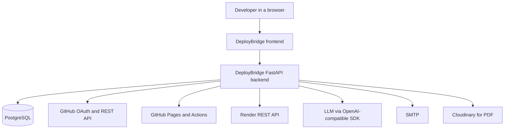

**What “done” means in this repository, stated plainly**

| Area | What exists in code today | What does not exist |
|---|---|---|
| Sign-in | GitHub OAuth, session JWT, profile read/update, refresh, logout | Email/password login, roles, admin login |
| Static deploy | Four Pages profiles: `html`, `jekyll`, `node-static`, `next-static` | Hugo, Sphinx, arbitrary custom workflows chosen by the user |
| Server deploy | Render web service, runtimes `python`, `node`, `docker` | Other Render runtimes through this API; other clouds |
| Render plan and region | Plan sent as `free`; region hardcoded `oregon`; one instance | Plan picker, region picker, scaling |
| History | List, detail, refresh, redeploy, delete of our own rows | A create-deployment endpoint (rows are written only as a side effect of deploy) |
| AI report | On-demand generate, history, PDF, email | A working schedule UI. The weekly job exists, but nothing in the API sets `is_scheduled` |
| Deploy agent | 11 tools, 8-step loop, approval gate on 4 side-effect tools | Streaming replies, LangChain, multi-agent crews |
| Tests | 24 API tests, mostly mocked, SQLite in memory | Tests of the real GitHub, Render, or LLM calls |

The project was built between **12 June 2026** and **21 September 2026** (60 commits). Early phase notes (`phases/1.md` to `phases/4.md`) stop at GitHub Pages profiles. Render, the analysis agent, email/PDF, the deploy agent, and the deployments history were added after those notes. A reader who only reads the phase files will under-count the product. This report uses the code, not only the phase notes.

### 1.2 Purpose & Goals

The practical problem is small and real. A student or junior developer has a repository on GitHub and wants a public URL. For a static site that means creating `.github/workflows`, choosing a build command, and enabling Pages. For a server that means creating a Render service, picking a runtime, and supplying build and start commands. Those steps are documented, but they are easy to get wrong the first time, and they are different for every framework.

DeployBridge’s purpose is to do that mechanical setup from one signed-in screen, and to leave a record of what was deployed.

**Goals that the code actually pursues**

| ID | Goal | How the code pursues it | Met? |
|---|---|---|---|
| G1 | One login, no separate password | GitHub OAuth code exchange, Fernet-encrypted token stored on the user row, session JWT for our API | Yes |
| G2 | Show the user’s repositories | `GET /v1/github/user` and `GET /v1/github/user/repos` proxy the GitHub API with the stored token | Yes |
| G3 | Detect static vs server | Pages `detect` and Render `detect` share one repository-context fetch | Yes, with a fixed rule set |
| G4 | Deploy a supported static site to Pages | Workflow template committed, Pages API enabled | Yes, for 4 profiles |
| G5 | Deploy a supported server to Render | `POST /v1/services` on Render, then poll | Yes, with the limits in Chapter 7 |
| G6 | Keep a history the user can refresh | `deployments` table plus refresh/redeploy/delete | Yes |
| G7 | Explain a repository in writing | Report agent loop, Markdown stored, PDF and email optional | Yes, on demand |
| G8 | Let an agent deploy, but not silently | Side-effect tools return a plan; the loop resumes only after `approve` | Yes for the deploy agent. **Not** for the report agent’s pull-request tool |
| G9 | Keep third-party secrets out of the chat model | Env-var values are merged on the server at approve time, not sent up as the plan text | Yes, for the deploy-agent Render path |
| G10 | Run without paid framework licences | FastAPI, PostgreSQL, vanilla JS, free GitHub and Render tiers, an OpenAI-compatible LLM key | Yes, with quota risk |

**Goals that were not taken up, and should not be claimed in a viva**

- Replacing GitHub or Render. Both remain the systems of record for the live site.
- Supporting every language Render supports. The API type is `Literal["python", "node", "docker"]`.
- A paid plan, a team billing page, or an organisation admin.
- Continuous deployment of DeployBridge itself as a multi-tenant SaaS. The frontend JavaScript calls `http://127.0.0.1:8000/v1` directly. That is a local-development URL.
- A mobile application.

**Purpose, in the language of the course template**

The template’s sample project (a tourism website) has a public visitor and an administrator who edits content. DeployBridge does not. The person who uses DeployBridge is the owner of the GitHub account. That person is both “the user” and “the operator of their own deploys”. There is no second login that can edit another student’s data. That difference matters in Chapters 3, 5, and 7, and it is stated there again so it is not softened later.

### 1.3 Technology

The stack is split the way the running system is split: a browser frontend with no bundler, and a Python backend. Versions below are taken from `requirements.txt`, CDN URLs in the HTML, and language features in the source. A library that is imported but not pinned in `backend/requirements.txt` is marked, because that is a real setup hazard.

#### 1.3.1 Frontend first

There is no `package.json` and no React, Vue, Angular, or Next.js app for DeployBridge itself. The UI is a multi-page site: HTML files, one CSS layer, and plain JavaScript modules. Tailwind is loaded from the Play CDN, which means the visual framework is **not version-pinned**.

| Technology | Version in the repo | Role |
|---|---|---|
| HTML5 | Living standard, no pin | Pages: landing, docs, and the app templates |
| CSS3 | Custom properties in `static/css` | Theme tokens, light/dark |
| JavaScript | Browser ES, no transpiler | Auth, dashboard, repositories, deployments, agent, reports, settings, profile |
| Tailwind CSS | Play CDN `https://cdn.tailwindcss.com` (unpinned) | Utility classes in the HTML |
| GSAP | **3.12.5** | Landing-page motion (`gsap.min.js`, `ScrollTrigger.min.js`) |
| Lenis | **1.1.18** | Smooth scroll on the landing page (`unpkg.com/lenis@1.1.18`) |
| marked | jsDelivr `/npm/marked/marked.min.js` (unpinned) | Render report Markdown in the browser |
| Google Fonts | Ubuntu, JetBrains Mono, Montenegrin Gothic One | Type |
| Browser storage | `localStorage` | Session JWT and theme key `db_theme` |

App pages that the user actually navigates:

| Page | File | What it is for |
|---|---|---|
| Landing | `frontend/index.html` | Public marketing page |
| Docs | `frontend/docs.html` and `templates/docs.html` | In-repo documentation page |
| Sign in | `templates/auth.html` | GitHub login and callback |
| Overview | `templates/dashboard.html` | Signed-in home, recent repos |
| Repositories | `templates/repositories.html` | Repo cards, detect, deploy modals |
| Deployments | `templates/deployments.html` | History, refresh, redeploy, custom domain |
| Agent | `templates/agent.html` | Chat with the deploy agent |
| Reports | `templates/reports.html` | Report list and view |
| Profile | `templates/profile.html` | GitHub profile fields we store |
| Settings | `templates/settings.html` | Deploy branch, Render connection |

JavaScript files mirror those screens: `app-shell.js`, `auth.js`, `overview.js`, `repositories.js`, `deployments.js`, `agent.js`, `reports.js`, `profile.js`, `settings.js`.

#### 1.3.2 Backend

The backend is a single FastAPI process. It is async. It talks to PostgreSQL through SQLAlchemy 2.0 and `asyncpg`. Schema changes go through Alembic.

| Technology | Version | Role |
|---|---|---|
| Python | **3.12+** required by the code | Nested quotes inside an f-string in `services/github.py` (PEP 701). `requirements.txt` does not pin the interpreter |
| FastAPI | **0.137.2** | HTTP API, dependency injection |
| Starlette | **1.3.1** | Underlying ASGI toolkit |
| Uvicorn | **0.49.0** | ASGI server |
| Pydantic | **2.13.4** | Request and response models |
| pydantic-settings | **2.14.1** | Environment loading |
| SQLAlchemy | **2.0.51** | ORM, async sessions |
| asyncpg | **0.31.0** | PostgreSQL driver used at runtime |
| psycopg2-binary | **2.9.12** (root `requirements.txt`) | Present; the app path uses asyncpg |
| Alembic | **1.18.4** | Migrations (9 revision files) |
| httpx | **0.28.1** | Outbound calls to GitHub and Render |
| PyJWT | **2.13.0** | Session tokens. This is the library the security module imports |
| python-jose | **3.5.0** | Pinned, not the library used for session JWT |
| cryptography | **49.0.0** | Fernet encryption of GitHub and Render secrets |
| passlib / bcrypt | **1.7.4 / 5.0.0** | Pinned. Login is GitHub OAuth, not a local password |
| openai | **3.13.0** | OpenAI-compatible client. Default base URL in `.env.example` is Gemini, not Groq |
| APScheduler | **3.10.4** | Weekly job for scheduled reports |
| cloudinary | **1.46.2** | PDF upload. Pinned in the root requirements file |
| xhtml2pdf | **0.2.18** | Markdown → HTML → PDF |
| python-dotenv | **1.2.2** | `.env` loading |
| PyYAML | **6.0.3** | Workflow templates |

`backend/requirements.txt` and the root `requirements.txt` are not the same file. PDF and Cloudinary pins were observed in the root file. A setup that installs only the shorter backend file can miss libraries the services import. That is recorded again as a limitation, not smoothed over here.

#### 1.3.3 Database

| Piece | Choice |
|---|---|
| Engine | PostgreSQL |
| Access | SQLAlchemy 2.0 async, `asyncpg`, pool size 5, max overflow 10, `pool_pre_ping=True`, `statement_cache_size=0` |
| Session | `expire_on_commit=False`, `autoflush=False` |
| Migrations | Alembic, 9 files under `alembic/versions/` |
| Tests | SQLite in memory (`sqlite+aiosqlite:///:memory:`), not PostgreSQL |

Tables: `users`, `repositories`, `deployments`, `repo_reports`, `agent_sessions`, `agent_messages`. Six tables. There is no `roles` table and no admin user table.

#### 1.3.4 AI layer — a loop, not LangChain

The agent does **not** use LangChain, LlamaIndex, CrewAI, or any agent framework. Both agents are a hand-written `for` loop:

- `report_agent.py`: `MAX_STEPS = 8`, temperature `0.2`, `MAX_OUTPUT_TOKENS = 4000`.
- `deploy_agent.py`: the same caps, plus `MAX_TOOL_RESULT_CHARS = 30000`.

Each step calls `GroqLLMClient`, which constructs an `AsyncOpenAI` client. The class name says Groq. The sample environment points `GROQ_BASE_URL` at `https://generativelanguage.googleapis.com/v1beta/openai/` and `GROQ_MODEL` at `gemini-1.5-flash`. A commented block shows how to point the same variables at Groq instead. So “Groq” in the code is a historical name for “whatever OpenAI-compatible endpoint is configured”.

The deploy agent advertises **11 tools** (7 read-only, 4 side-effect). A comment near the top of `deploy_agent.py` still says “9 tools”. The list in the code is the truth: `detect_stack`, `read_repo_file`, `get_render_status`, `get_render_logs`, `list_deployments`, `list_repositories`, `analyze_repository`, `deploy_github_pages`, `deploy_render`, `create_pull_request`, `add_render_custom_domain`.

#### 1.3.5 External platforms

| Platform | What we use it for | What we do not control |
|---|---|---|
| GitHub OAuth and REST | Login, repo list, file read, workflow commit, Pages API, pull requests | GitHub rate limits, OAuth app review, Pages build minutes |
| GitHub Actions | The workflow files we commit actually build the site | The Actions runner, third-party actions inside those templates |
| Render REST `https://api.render.com/v1` | Create web service, list, redeploy, logs, custom domain | Plan quotas, region capacity, spin-down of free services |
| LLM provider | Report text and agent decisions | Model quality, price, outages, data-retention policy of that provider |
| Cloudinary | Store generated PDFs | Account limits; feature is optional |
| SMTP | Email a report | Optional; if unset, email fails rather than the whole app |

<div style="page-break-after: always;"></div>

# CHAPTER 2

## PROJECT PROFILE

### 2.1 Project Planning and Scheduling

#### 2.1.1 Project Development Approach

The development approach was **incremental**, not a single waterfall pass and not a formal Scrum board. The repository itself is the evidence:

- `phases/1.md` records folder structure, config, logging, exceptions, lifespan, and a health endpoint.
- `phases/2.md` records GitHub OAuth and the user row.
- `phases/3.md` records the first Pages path, limited to HTML, CSS, and JavaScript.
- `phases/4.md` widens Pages to four profiles and adds detection.
- After the phase notes stop, commits continue: a GitHub Actions workflow for the frontend, settings and deploy-branch column, repository view, analysis agent, SMTP, landing page, then Render, deployments UI, and the deploy agent (13–21 September 2026).

So the approach was: make a thin vertical slice, write a phase note, then widen the slice when the previous one worked. Later slices (Render, agents) did not get a `phases/5.md`. That is a documentation gap, not proof that the work did not happen.

There are not two product modules called “User” and “Administrator”, which is the split in the course template. The split that exists is:

| Module | Who uses it | What it can change |
|---|---|---|
| Public pages | Anyone with the URL | Nothing in the database. Landing and docs only |
| Signed-in developer | A GitHub user who completed OAuth | Only their own user row, their own deploys, their own reports, their own agent sessions |
| External platforms | GitHub, Render, the LLM | Their own systems. DeployBridge sends API calls; it does not administer those platforms |

There is no screen where one student can edit another student’s deployment. There is no staff login.

#### 2.1.2 Project Planning

Planning was driven by the deployment job, not by a written business model. The questions the team actually had to answer, in the order the commits show, were:

1. Can the backend start and answer `/v1/health`?
2. Can a user sign in with GitHub and can we store the token safely enough to call GitHub later?
3. Can we publish a no-build HTML repository to Pages?
4. Can detection choose among several static profiles instead of refusing anything that is not raw HTML?
5. Can we explain a repository with an LLM, and can we deliver that explanation as PDF or email?
6. Can a server repository go to Render without the user copying commands from two dashboards?
7. Can a chat agent do steps 3 and 6 only after the user approves?

Each question became an API group. The route file `backend/src/api/router.py` is the plan that survived: health, auth, github, github-pages, reports, render, deployments, agent. Forty-one endpoints sit under the prefix `/v1`.

**Work breakdown that matches the code, not a generic SDLC poster**

| Work package | Output that exists | Depends on |
|---|---|---|
| WP1 Foundation | `main.py`, config, logger, exceptions, lifespan, health | Python environment |
| WP2 Identity | OAuth, user table, Fernet, JWT | GitHub OAuth app |
| WP3 Pages | Detect, four YAML templates, deploy, custom domain | WP2 |
| WP4 Reports | Agent loop, `repo_reports`, PDF, Cloudinary, SMTP, scheduler stub | WP2, LLM key |
| WP5 Render | Connect, detect, deploy, services, logs, custom domain | WP2, Render API key |
| WP6 History | `deployments` rows written by WP3 and WP5, refresh and redeploy | WP3, WP5 |
| WP7 Deploy agent | Sessions, 11 tools, approve endpoint | WP3, WP5, WP6, LLM key |
| WP8 Frontend | MPA templates and JS calling `/v1` | WP1–WP7 |
| WP9 Tests | 24 pytest cases | WP8 not required; API only |

A planning mistake worth stating: WP4’s scheduler was built (`is_scheduled` column, Monday 09:00 job) before any API existed to turn scheduling on. The column is therefore unused. That is recorded in Chapter 7 as a dormant feature, not as a delivered scheduler.

### 2.2 Risk Management

#### 2.2.1 Risk Identification

Risks below were identified by reading the code and the commit history. They are project risks, not the tourism-template risks (Flash player, political permission to publish a photograph).

| ID | Risk | Class |
|---|---|---|
| R1 | GitHub or Render changes a REST field we depend on | Technical |
| R2 | Free-tier quota (Render 402, GitHub rate limit, Actions minutes) stops a demo | Technical / economic |
| R3 | LLM provider is down, slow, or returns a tool call we do not handle | Technical |
| R4 | Secrets leak: GitHub token, Render key, JWT, SMTP password | Security |
| R5 | Report agent opens a pull request without a confirm step | Security / product |
| R6 | Frontend hardcoded to `127.0.0.1:8000`, so a hosted demo breaks | Technical / schedule |
| R7 | Scope grew past the four phase notes; documentation lags the code | Schedule / academic |
| R8 | Two requirements files diverge; a marker installs an incomplete environment | Technical |
| R9 | Tests mock GitHub and Render, so a green pytest does not mean a live deploy works | Quality |
| R10 | Free Render services sleep; a viva demo looks “down” when the service is only cold | Operational |
| R11 | OAuth callback URL, CORS origin, and JWT secret are mis-set on a new machine | Operational |
| R12 | Detection mis-classifies a repository (static site sent to Render, or the reverse) | Product |
| R13 | Third-party cost: LLM tokens, Cloudinary, a Render plan upgrade | Economic |
| R14 | Academic integrity of the report: claiming features that are only comments | Academic |

Political risk in the template’s sense (permission to publish a private organisation’s photo) does not apply. The nearest equivalent is platform policy: a GitHub OAuth app must use the scopes we request, and we must not store a user’s token in logs. That is R4, not a political risk.

#### 2.2.2 Risk Analysis

| ID | How it hits this project | Likelihood in a student demo | Impact |
|---|---|---|---|
| R1 | Pages payload or Render `serviceDetails` shape changes; deploy returns 4xx | Medium over a year, low in one week | High — the core feature breaks |
| R2 | Code already maps Render HTTP 402 to “free-tier limit reached” and mentions examples: 25 services, 750 instance-hours/month, 500 build minutes. Those numbers are the message we show; they are Render’s quota, not a quota we enforce | High if many services already exist on the free workspace | High for the demo, none for data safety |
| R3 | Report and chat return an error state; deploys that do not need the LLM still work | Medium | Medium |
| R4 | Tokens are Fernet-encrypted at rest. JWT defaults to a very long life (`ACCESS_TOKEN_EXPIRE_MINUTES` default **10000**, about 7 days). JWT is in `localStorage`. Logout does not revoke the token server-side | Medium if a laptop is shared | High |
| R5 | `report_agent.py` calls `GitHubService.create_file_and_pull_request` inside the tool loop, with no approve endpoint | Medium whenever a report run is allowed to call tools | High — it writes to the user’s GitHub |
| R6 | Every app JS file sets `BACKEND_API_URL = "http://127.0.0.1:8000/v1"` or inlines that host | Certain, if anyone hosts only the frontend | High for deployment of DeployBridge itself |
| R7 | Phase notes end at Pages profiles. Render and agents are only in code and commits | Certain | Medium for the viva, low for the software |
| R8 | Import of `xhtml2pdf` and `cloudinary` will fail if those packages are absent | Medium on a clean backend-only install | Medium |
| R9 | 24 tests, SQLite, mocks around deploy | Certain — this is the current suite | Medium. It can create false confidence |
| R10 | Detect always returns `plan="free"`. The UI displays that plan and sends it back. Free web services on Render spin down after inactivity. The deploy modal does not warn about cold start | High | Medium for a demo, low for correctness |
| R11 | `.env.example` leaves secrets empty. CORS is a comma-separated setting | High on first clone | Medium |
| R12 | Rules are heuristic: Dockerfile, Next.js static-export check, Python markers, Node server frameworks, else docker | Medium on unusual repos | Medium — user can still be wrong but the plan is visible before deploy in the agent path |
| R13 | A long agent chat burns tokens. Cap is 8 steps and 4000 output tokens, which bounds but does not remove cost | Medium | Low to medium |
| R14 | A comment says 9 tools; the list has 11. A schema comment says other Render runtimes can be passed explicitly; the `Literal` rejects them | Certain if the report copies comments | High for assessment |

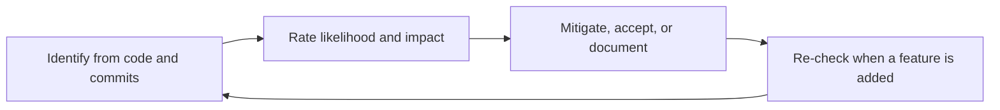

#### 2.2.3 Risk Planning

| ID | What we did in code | What is still only a warning |
|---|---|---|
| R1 | Errors from GitHub and Render are mapped to our own error types instead of leaking raw bodies on 4xx | No contract tests against live APIs |
| R2 | HTTP 402 becomes a readable `RenderError` | We do not pre-check quota before create. User finds out when Render refuses |
| R3 | If the report loop hits 8 steps it forces a final answer without tools | No fallback model, no queue, no user-visible token budget |
| R4 | Fernet for GitHub token and Render key. JWT algorithm is fixed, which blocks `alg=none`. Status endpoint must not return the Render key | Long JWT TTL, `localStorage`, no server-side revoke list |
| R5 | Deploy agent gates four side-effect tools | Report agent is not gated. Fix is future work, not a claim of safety |
| R6 | CORS is configurable, so the backend can allow a real origin | Frontend host is not configurable. Must be edited in several JS files |
| R7 | This report and the phase files | Phase files were not updated after August |
| R8 | Both requirement files are in the repo | They should be one file. They are not |
| R9 | Tests cover auth positive and negative, and a mocked happy path for Pages and Render connect | Live smoke script `verify_integrations.py` is manual |
| R10 | Documented here and in Chapter 7 | No in-product warning, no “wake service” button beyond redeploy |
| R11 | `.env.example` lists the names. Lifespan starts even if some optional services are missing | A missing `JWT_SECRET_KEY` or database URL is still fatal, as it should be |
| R12 | Detect returns a `reason` string. Agent shows a plan card before side effects | Heuristics can still be wrong; user must read the reason |
| R13 | Step cap, output cap, tool-result truncation | No per-user quota |
| R14 | This report prefers code over comments | Future readers must keep doing that |

Economical risk, stated the way an examiner expects and the way the code supports: the project can be demonstrated on free tiers plus one LLM API key. It is not free of third parties. If the Render workspace is already full, or the LLM key has no credit, the demo fails even though our code is unchanged. There is no licence fee for FastAPI, PostgreSQL, or the frontend libraries we use.

### 2.3 Schedule Representation

The course template asks for estimated days and actual days. This repository does not contain a timesheet. Inventing “Coding = 40 estimated, 30 actual” would be a false record. What the repository does contain is commit dates. The table below is a **calendar span reconstructed from `git log`**, not a claim that someone worked every day in the span.

| Stage | First commit in span | Last commit in span | Calendar span | What landed |
|---|---|---|---|---|
| Study and template docs | 2026-06-12 | 2026-06-17 | 6 days | Initial commit, `SupportDocs` added |
| Foundation (Phase 1) | 2026-06-18 | 2026-06-18 | 1 day | Backend skeleton, health, phase-1 note |
| OAuth and first UI (Phase 2) | 2026-06-21 | 2026-06-26 | 6 days | Login, user table, auth and dashboard HTML |
| Static Pages workflow (Phase 3) | 2026-07-05 | 2026-07-08 | 4 days | User columns, HTML/CSS/JS workflow, auth UI |
| Profile detection and frontend host (Phase 4 and after) | 2026-08-07 | 2026-08-24 | 18 days | Actions for our own frontend, settings, deploy branch, repo card, CSS fixes |
| Reports and public pages | 2026-09-09 | 2026-09-15 | 7 days | Analysis agent, docs page, landing page, SMTP |
| Render, history, deploy agent, tests | 2026-09-16 | 2026-09-21 | 6 days | Render service, deployments UI, agent tool-calling fixes, CORS, requirements |
| Testing as a separate phase | — | — | Not separate | Tests appear inside the September fixes, not as a 10-day block after coding |

Commit counts by month: June 18, July 4, August 12, September 26. Total 60. The September cluster is the largest. That matches a project that looked “finished” at Pages, then took on Render and agents late.

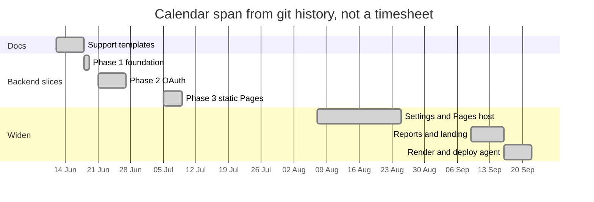

**How progress was tracked**

The template lists status meetings, milestone reviews, and earned-value analysis. This project did not keep those artefacts in the repository. Tracking that does exist:

- Commit messages, which are informal and sometimes misspelled, but dated.
- `phases/1.md`–`phases/4.md`, which stop too early.
- This report, written after the code, as a reconstruction.

A project manager reading only the phase files would think the project ended at static-site profiles. A project manager reading `git log` would see that the risky work (Render and the agent) was compressed into the last week of the recorded history. That compression is itself a schedule risk: less time to test live deploys.

**Milestones that can be defended**

| Milestone | Evidence | Date |
|---|---|---|
| M1 Backend boots | Phase 1 note, health route | 2026-06-18 |
| M2 User can sign in | OAuth routes, user migration | 2026-06-21 |
| M3 HTML repo can be sent to Pages | July workflow commits, phase 3 note | 2026-07-07 |
| M4 More than one Pages profile | Phase 4 note, four YAML templates | August 2026 (note); templates present in tree |
| M5 A report can be generated and mailed | Commits of 11–13 September | 2026-09-13 |
| M6 A Render service can be created from the app | `render.py` service and routes, commits 16–19 September | 2026-09-19 |
| M7 Agent will not deploy without approval | Approve route and side-effect gate in `deploy_agent.py` | 2026-09-21 |

M4’s exact day is the weakest of these, because the phase note is not a commit by itself. The templates are in the tree at the baseline we studied. That is enough to say the feature exists. It is not enough to invent an “actual days” cell.

<div style="page-break-after: always;"></div>

# CHAPTER 3

## SYSTEM REQUIREMENT SPECIFICATION

### 3.1 User Characteristics

The course template assumes two human roles: a visitor who only reads, and an administrator who edits the database. DeployBridge has a different cast. Forcing an “admin module” into this report would describe software that was not built.

| Actor | Human or system | What they can do in this product | What they cannot do |
|---|---|---|---|
| Guest | Human | Open the landing page and the docs page | See repositories, deploy, chat, or read reports |
| Developer | Human, must have a GitHub account | Sign in, list their repos, detect, deploy to Pages or Render, read history, chat with the agent, generate a report, edit their own profile and deploy branch, connect or disconnect a Render key | See another user’s rows. There is no role flag that upgrades them |
| GitHub | External system | Identity, repo contents, Actions, Pages, pull requests | Is not configured by a screen inside DeployBridge beyond the OAuth app the team registers |
| Render | External system | Builds and runs the web service, holds the real env vars, serves the URL | Region, instance count, and plan are not chosen in our UI |
| LLM provider | External system | Next tool call or final text | Does not receive Render env-var values on the approve path; those are merged in our server |
| Mail and Cloudinary | External, optional | Deliver or store a PDF | Not required for deploy |

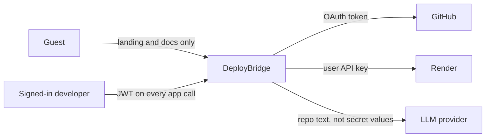

**Characteristics of the developer, which is the only real user**

- Comfortable enough with GitHub to create a repository and authorise an OAuth app.
- Owns, or can obtain, a Render API key if they want a server deploy. Pages deploy does not need Render.
- Understands that a free Render URL may be asleep. The product does not teach this in the modal; the report does, because a viva will otherwise treat a cold start as a bug in our code.
- Uses a desktop browser. The pages are responsive in the sense that they are HTML, but they were built as a dashboard, not as a phone app. No device testing is recorded in the repo.
- Speaks enough English to read the UI. There is no localisation file.

**Characteristics we do not have**

- No anonymous deploy. Every deploy route depends on the current user.
- No organisation administrator who can deploy on behalf of a team from inside DeployBridge. If the Render key can see only team workspaces, the connect path falls back to the first team owner. There is still no picker.
- No “content editor” role. We do not host tourism text, hotel rows, or comments.

### 3.2 Software and Hardware Requirement

#### Software requirement — to run DeployBridge

| Layer | Requirement | Version we developed against |
|---|---|---|
| Operating system | Linux, macOS, or Windows with Python. Development history does not pin an OS | Not recorded |
| Interpreter | Python 3.12 or newer | Required by PEP 701 syntax in `github.py` |
| API | FastAPI 0.137.2, Uvicorn 0.49.0 | Pinned |
| Database server | PostgreSQL reachable by `DATABASE_URL` | Driver asyncpg 0.31.0 |
| Browser | A current browser with JavaScript enabled | No IE 6 target. The template’s Internet Explorer row does not apply |
| GitHub | An OAuth App: client id, client secret, callback URL | Account-level setup, not a library |
| Render | API key only if Render features are used | User-supplied `rnd_...` key |
| LLM | API key plus base URL if reports or the agent are used | Sample points at Gemini’s OpenAI-compatible endpoint |
| Optional | Cloudinary trio, SMTP host/user/password | Email and PDF hosting degrade if absent |

#### Software requirement — to deploy a user’s project through DeployBridge

| Target | The user’s repository must look like | DeployBridge will not |
|---|---|---|
| GitHub Pages | One of `html`, `jekyll`, `node-static`, `next-static` | Invent a fifth profile |
| Render | `python`, `node`, or `docker`, with build and start commands for the native runtimes | Send `go`, `ruby`, `rust`, `elixir`, or a prebuilt image through this API |

#### Hardware requirement — to develop and demonstrate

The template’s Pentium IV / 512 MB row is obsolete and is not our requirement. Realistic minimums for this codebase:

| Machine | Processor | Memory | Disk | Network |
|---|---|---|---|---|
| Developer laptop | Any 64-bit CPU of the last decade | 8 GB recommended, 4 GB uncomfortable once PostgreSQL, the API, and a browser are open | About 1 GB for the checkout, virtualenv, and database. The repo itself is small | Required. OAuth, GitHub, Render, and the LLM are all remote |
| Database host | Can be the same laptop | PostgreSQL’s own footprint | Grows with reports and agent messages, not with the user’s source code. We do not clone full repositories into PostgreSQL | Local socket or TCP |
| End-user machine | A laptop or desktop browser | No install of Python | None, if they use a hosted frontend | Required |

We do not ship a mobile client, a desktop installer, or a GPU requirement. The LLM runs on the provider’s machines.

#### Software requirement — examiner’s machine, if they only read the report

A Markdown viewer that can render Mermaid (GitHub, Typora, Obsidian, or VS Code with a Mermaid extension). Page-break divs are honoured by Typora and by typical Markdown-to-PDF tools. They are ignored by GitHub’s preview, which is acceptable.

### 3.3 Constraint

Constraints are limits we accept as part of the design, as distinct from defects listed in Chapter 7. Some items appear in both places, because a constraint that was never written down still binds the user.

| ID | Constraint | Why it is a constraint and not a bug we forgot to mention |
|---|---|---|
| C1 | The user must have a GitHub account and must approve the OAuth app | Identity is delegated. We will not add a local password just to look like the template |
| C2 | DeployBridge can deploy only to GitHub Pages and Render | Those are the two integrations that were built |
| C3 | Pages profiles are exactly four | The template files on disk are the supported set |
| C4 | Render create always uses region `oregon`, plan `free` on the product path, and `numInstances = 1` | Hardcoded in `RenderService.create_web_service` and in detect |
| C5 | A native Render runtime requires both a build command and a start command | Render’s API requires it; we return 400 if either is missing |
| C6 | The browser must call the backend. The checked-in frontend calls localhost | Hosting constraint until that constant is changed |
| C7 | One user sees only their own rows | Enforced by `user_id` filters on queries, not by an admin override, because there is no admin override |
| C8 | Side-effect agent tools do not run until approve | Product constraint of the deploy agent |
| C9 | Secrets are not typed into the chat transcript | Product constraint. The UI collects env-var values at approve time |
| C10 | Optional services fail independently | No Cloudinary means no hosted PDF URL. No SMTP means no email. Deploy still works |
| C11 | The user must have rights on the GitHub repository | We cannot deploy a repository the token cannot write to |
| C12 | Custom domain DNS is done at the user’s DNS host | We return the CNAME target. We cannot edit GoDaddy or Cloudflare for them |
| C13 | English UI, no offline mode | Not designed |
| C14 | Session JWT is a bearer token | Anyone who copies it can call the API until it expires. Logout is a client-side delete |

**User cannot modify another user’s website.** That sentence is true, and it is the closest honest reading of the template line “User cannot modify website / Only administrator modifies website”. In DeployBridge the developer can modify only the deploys and GitHub content that their own token can reach. There is no administrator who modifies it instead of them.

<div style="page-break-after: always;"></div>

# CHAPTER 4

## ANALYSIS AND DESIGN

### 4.1 System Requirements

Requirements below are written so that each one can be pointed at a file. “The system should be user friendly” is kept, but it is not treated as a testable requirement by itself.

#### 4.1.1 Functional requirements

| ID | Requirement | Satisfied by | Status |
|---|---|---|---|
| FR1 | A guest can open a public landing page and a docs page | `frontend/index.html`, `frontend/docs.html` | Met |
| FR2 | The system shall redirect the user to GitHub to authorise | `GET /v1/auth/login` | Met |
| FR3 | The system shall exchange the OAuth code, store the encrypted token, and return a session JWT | `GET /v1/auth/callback` | Met |
| FR4 | The system shall return and update the current user’s profile | `GET` and `PATCH /v1/auth/profile` | Met |
| FR5 | The system shall refresh and clear a session | `POST /v1/auth/refresh`, `POST /v1/auth/logout` | Met. Logout does not revoke the JWT on the server |
| FR6 | The system shall list the GitHub user and their repositories | `GET /v1/github/user`, `GET /v1/github/user/repos` | Met |
| FR7 | The system shall return repository detail used by the repo card | `POST /v1/github/repos/info` | Met |
| FR8 | The system shall detect a Pages profile and explain the choice | `POST /v1/github-pages/detect` | Met for the four profiles |
| FR9 | The system shall deploy a supported repo to GitHub Pages | `POST /v1/github-pages/deploy` | Met |
| FR10 | The system shall add and verify a Pages custom domain | two `POST` routes under `/v1/github-pages/custom-domains/...` | Met as an API. DNS itself is external |
| FR11 | The system shall validate a Render API key and remember the workspace id | `POST /v1/render/connect` | Met. Personal workspace preferred |
| FR12 | The system shall show Render connection status without returning the key | `GET /v1/render/status` | Met |
| FR13 | The system shall forget the stored Render key | `DELETE /v1/render/connect` | Met |
| FR14 | The system shall recommend a Render runtime | `POST /v1/render/detect` | Met for python, node, docker |
| FR15 | The system shall create a Render web service and return service id, deploy id, and URL | `POST /v1/render/deploy` | Met, with C4 |
| FR16 | The system shall list and read Render services, and redeploy one | `GET /v1/render/services`, `GET /v1/render/services/{id}`, `POST .../redeploy` | Met |
| FR17 | The system shall add and verify a Render custom domain and return a CNAME target | two `POST` routes under `/v1/render/services/{id}/custom-domain` | Met |
| FR18 | The system shall record a deployment when Pages or Render deploy succeeds in our handler | writes inside those handlers, not a public create route | Met |
| FR19 | The system shall list, read, refresh, redeploy, and delete deployment history for the current user | five routes under `/v1/deployments` | Met |
| FR20 | The system shall generate an analysis report and keep history | `POST /v1/reports/generate`, `GET /v1/reports/history`, `GET /v1/reports/{id}` | Met |
| FR21 | The system shall delete a report, email it, and return a PDF | delete, `send-email`, `pdf` routes | Met if SMTP and PDF libraries are installed |
| FR22 | The system shall run a weekly job for repositories flagged `is_scheduled` | `scheduler.py`, Monday 09:00 | **Not met as a feature.** Nothing writes `is_scheduled = true` |
| FR23 | The system shall keep agent sessions and messages | six routes under `/v1/agent` | Met |
| FR24 | The system shall execute read-only agent tools without asking, and shall pause on side-effect tools | `DeployAgentRunner` loop | Met |
| FR25 | The system shall resume or cancel a paused plan | `POST /v1/agent/messages/{id}/approve` | Met |
| FR26 | The user shall be able to set a preferred deploy branch | `deploy_branch` column, settings page | Met |
| FR27 | The system shall check that the process is up | `GET /v1/health` returns `{"status": "Ok"}` | Met. It does not check the database |

#### 4.1.2 Non-functional requirements

| ID | Requirement | How it is handled | Honest gap |
|---|---|---|---|
| NFR1 | Only the token holder calls protected routes | `Authorization: Bearer` dependency `get_current_user` | Stolen token works until expiry |
| NFR2 | Secrets at rest are not plaintext | Fernet, key from `GITHUB_TOKEN_ENCRYPTION_KEY` | Key in `.env`. Loss of that key loses the tokens |
| NFR3 | A user cannot read another user’s deployment by guessing an id | Queries filter on `user_id` | Must stay true in every new query. Not proved by a dedicated test for every route |
| NFR4 | Third-party 4xx bodies are not dumped to the user when they may contain secrets | Render error mapper | 5xx detail includes a short Render message on purpose |
| NFR5 | Agent cost is bounded | 8 steps, 4000 output tokens, 30000-character tool results | Bound is per run, not per day |
| NFR6 | The UI should be understandable without a manual | Labels, plan summary sentences, detect `reason` | No usability study is in the repo |
| NFR7 | The API should be inspectable | FastAPI `/docs` when docs URL is enabled | Disabled if `DOCS_URL` is empty |
| NFR8 | Failure of email must not block deploy | Separate services | True by structure |
| NFR9 | Database schema changes are repeatable | Alembic | Two deployment-related revisions exist; a fresh install must run the chain, not one file |
| NFR10 | Response time | Short httpx timeouts: Render default 30 s, create 60 s | No load test, no SLO |

### 4.2 Feasibility Analysis

Feasibility here means “should this project have been attempted, and did the attempt stay possible”. It is judged after the code exists, which is the honest position. A feasibility study written in June would have been a prediction. This section is an assessment.

#### 4.2.1 Technical feasibility

Technically feasible, and largely demonstrated.

- GitHub OAuth and the Pages API are public and were used successfully enough to leave working service code and a July commit that says the HTML workflow was created.
- Render’s create-service API matches the payload we build (`runtime`, `plan`, `region`, `envSpecificDetails`). The mapping of 401, 402, 403, 404, and 429 shows the team hit real API behaviour, or at least read it carefully enough to encode it. This report does not claim a live deploy was re-run on 25 September 2026.
- An OpenAI-compatible SDK can talk to Gemini or Groq without an agent framework. That removed a dependency and kept the loop readable. It also means we own every edge case LangChain would have owned.
- PostgreSQL plus Alembic is a normal, feasible store for six tables.
- The frontend without a bundler is feasible for this size (about 3,100 lines of JS). It becomes less feasible if the hardcoded host and duplicated page scripts keep growing.

Not feasible inside the current design, and correctly not attempted: deploying arbitrary languages to arbitrary clouds, streaming tokens, multi-region active-active, or a mobile client.

#### 4.2.2 Economic feasibility

Feasible for a college project.

| Cost | Who pays | Can it be zero? |
|---|---|---|
| GitHub | The user’s GitHub account | Yes, on the free plan, until Actions minutes or Pages limits are hit |
| Render | The user’s Render workspace | The product path always requests the free plan. Free is zero currency and non-zero quota |
| LLM | Whoever owns `GROQ_API_KEY` | No, unless the provider’s free tier covers the demo |
| Cloudinary and SMTP | Optional accounts | Yes, if those features are not demonstrated |
| Our hosting | Whoever runs Uvicorn and PostgreSQL | Yes, on a laptop |
| Libraries | None of the core libraries are paid | Yes |

The economic risk is quota, not licence. A workspace that already has many free services will get HTTP 402. The application cannot buy capacity for the user.

#### 4.2.3 Operational feasibility

Feasible for a developer who can run two processes and fill a `.env` file. Not feasible as a public multi-tenant website without the changes in Chapter 7 (frontend host, JWT storage, secret rotation, live monitoring).

Operational dependencies that a demo must have ready:

1. PostgreSQL running, migrations applied.
2. GitHub OAuth app callback pointing at the frontend origin actually in use.
3. `CORS_ALLOWED_ORIGINS` including that origin.
4. A repository the demo user can write to.
5. For the Render half of the demo, a valid API key and a free-plan slot in `oregon`.
6. For the agent half, an LLM key with remaining quota.

#### 4.2.4 Schedule feasibility

The recorded calendar was about 14 weeks (12 June to 21 September 2026), part-time, four commit authors. That was enough to reach a demonstrable system. It was not enough to:

- update phase notes after Pages;
- write a live integration suite;
- put a confirm gate on the report agent;
- replace the localhost API constant.

Those are schedule consequences, and they are listed as limitations rather than as forgotten requirements that “must have been implemented”.

#### 4.2.5 Legal and ethical feasibility

Feasible if the demo uses the team’s own repositories and the team’s own API keys.

- We store a GitHub access token and a Render API key. They are encrypted, but they are still secrets. The report and the viva must not paste `.env` values.
- The report agent can open a pull request. That writes to a repository the user authorised. It is legal relative to GitHub’s API if the token has the scope. It is still a sharp tool, because the user may not expect a report action to open a PR.
- Repository source is sent to the configured LLM when a report or the agent reads files. Users must accept that. The product does not offer a “do not leave this machine” mode.
- This report does not copy the tourism sample’s prose. The chapter headings follow the template. The facts follow DeployBridge.

### 4.3 Requirement Validation

Validation means checking that a requirement is necessary, unambiguous, and either implemented or explicitly deferred. The method used for this report was a trace from the route list and the phase notes back to FR1–FR27. No separate signed SRS was found in the repository.

| Check | Result |
|---|---|
| Is each functional requirement tied to a route or a job? | Yes, in the table in 4.1.1 |
| Is any requirement contradicted by the code? | FR22 is contradicted. The job exists; the switch does not |
| Are comments validated against code? | No. The “9 tools” comment fails validation. The “pass elixir/go explicitly” schema comment fails validation against `RenderRuntime` |
| Are requirements testable? | FR1–FR21 and FR23–FR27 are testable. NFR6 is not, as written |
| Did automated tests validate them? | Partly. Chapter 6 lists the 24 tests and the holes |
| Were requirements signed off by a guide before coding? | Not present in the repo. Do not claim a sign-off that is not filed |

**Requirement decision log (what we refused)**

| Proposed idea | Decision | Reason |
|---|---|---|
| Local username and password, as in the template | Refused | GitHub is the identity |
| Admin panel to edit other users | Refused | No such role is needed for a per-user bridge |
| Deploy to every host | Refused | Two integrations are the scope |
| Let the chat agent deploy on the first tool call | Refused for the deploy agent | Human approval is the safety property |
| Same approval rule for the report agent | Not done | Inconsistency. Recorded as a defect, not as a decision to be proud of |

### 4.4 Requirement Gathering

Sources that actually exist:

| Source | What it contributed | What it did not contribute |
|---|---|---|
| `phases/1.md` to `phases/4.md` | The early functional spine: health, OAuth, Pages, then four profiles | Render, reports, agent, deployments history |
| `SupportDocs/*.docx` | The chapter headings of this report, the college cover wording | No DeployBridge requirements. The sample content is a Junagadh tourism site |
| Git commit messages, June–September 2026 | The order features really arrived | Effort hours |
| The source tree at the 2026-09-21 baseline | The requirements in 4.1, read backwards from behaviour | A record of rejected interviews |
| Platform docs encoded in comments | Render payload rules, dated in a comment as checked on 2026-09-16 | A guarantee that Render has not changed since |

What this section will not invent: stakeholder interview minutes, a questionnaire, or a client from industry. If the team held those, they are not in the repository, and this report does not pretend they are.

The gathering method that fits the evidence is **incremental elicitation by the developers themselves**. The users and the authors are the same kind of person: a student with a GitHub repo who wants a URL. That is why the requirements look like a developer’s checklist and not like a tourism content catalogue.

### 4.5 Process Model

The process model that fits is **incremental development** with a thin written phase gate for the first four increments only.

It is not pure waterfall. Design did not finish before coding. The Render payload was learned while the Render service was written (the module comment cites the live API reference of 16 September 2026, which is the same week the feature landed).

It is not a documented Scrum process. There is no sprint length, no backlog file, and no velocity.

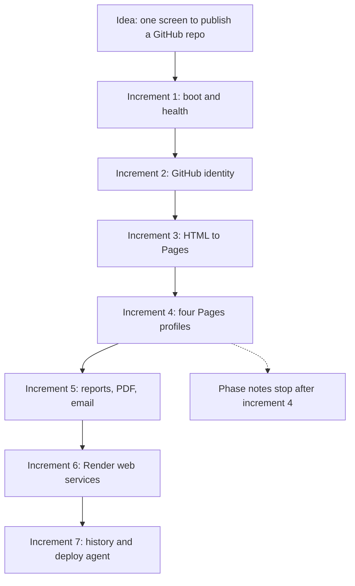

Each increment was accepted when its route answered, not when a formal test plan was signed. Testing was added late (test scripts appear in the 19 September commits) and covers the API surface thinly. That is allowed in an incremental student project. It must not be described as test-driven development.

**Why this model was suitable**

- The hardest unknown was external APIs, which only reveal themselves when called.
- A vertical slice (login, then one deploy) produced something a guide could click.
- Later slices reused the same pattern: schema, service class, router, frontend modal.

**Where the model hurt**

- Increment 5’s scheduler was a horizontal stub with no UI, so it looks finished in the file tree and does nothing in the product.
- Increment 7 landed in six days. The confirm gate is real, but the automated tests do not walk an approve/cancel path.

### 4.6 System Design

#### 4.6.1 Data dictionary

Six tables. Types below follow the SQLAlchemy models. UUID primary keys are application-generated, not database sequences. That is a deliberate difference from the template’s `Int` identity columns.

**users**

| Column | Type | Description |
|---|---|---|
| id | UUID | Primary key |
| github_id | string, unique | GitHub numeric id, stored as string |
| username | string | GitHub login |
| email | string, nullable | Primary email if GitHub returned one |
| avatar_url | string, nullable | Profile image URL |
| github_token | text, nullable | Fernet ciphertext, never returned to the browser |
| github_token_type | string, nullable | Usually bearer |
| github_scope | string, nullable | Scopes granted at login |
| deploy_branch | string, nullable | Preferred branch edited from settings |
| render_api_key | text, nullable | Fernet ciphertext of the Render key |
| render_owner_id | string, nullable | Workspace id (`tea-...`) chosen at connect |
| created_at, updated_at, last_login | timestamp | Bookkeeping |

**repositories**

| Column | Type | Description |
|---|---|---|
| id | UUID | Primary key |
| user_id | UUID | Owner |
| owner, name | string | GitHub coordinates |
| is_scheduled | boolean, default false | Intended flag for the Monday job. No API sets it |
| schedule_frequency | string, default weekly | Stored, unused by the cron expression, which is fixed to Monday 09:00 |
| created_at | timestamp | Row creation |

**deployments**

| Column | Type | Description |
|---|---|---|
| id | UUID | Primary key |
| user_id | UUID | Owner |
| platform | string | `github_pages` or `render` |
| owner, repo, branch | string | What was deployed |
| profile | string, nullable | Pages profile, when applicable |
| status | string | `pending`, `building`, `live`, `failed` |
| service_id | string, nullable | Render service id |
| external_deploy_id | string, nullable | Render deploy id or the external id we stored |
| url | string, nullable | Public URL. For Pages, if refresh does not yet have one, the code falls back to `https://{owner}.github.io/{repo}` |
| error | text, nullable | Last error |
| created_at, updated_at | timestamp | Bookkeeping |

There are two Alembic revisions whose names both mention deployments (`dece5564cf24_add_deployments_table.py` and `9f8ae6414de0_add_deployments_and_agent_tables.py`). A fresh database must apply the chain Alembic computes. Copying one file by hand would be wrong.

**repo_reports**

| Column | Type | Description |
|---|---|---|
| id | UUID | Primary key |
| user_id | UUID | Owner |
| owner, repository, repo_full_name | string | Target repo |
| report_markdown | text, nullable | The report body |
| model_used | string, nullable | Model name returned for that run |
| prompt_tokens, completion_tokens | int | Usage |
| duration_ms | int | Server-side duration |
| status | string | Job state |
| cloudinary_url | string, nullable | Set only if upload worked |
| error_message | text, nullable | Failure reason |
| generated_at, created_at | timestamp | Bookkeeping |

**agent_sessions**

| Column | Type | Description |
|---|---|---|
| id | UUID | Primary key |
| user_id | UUID | Owner |
| title | string | Default “New chat” |
| state | string | `idle`, `running`, `awaiting_approval`, `error` |
| created_at, updated_at | timestamp | Bookkeeping |

**agent_messages**

| Column | Type | Description |
|---|---|---|
| id | UUID | Primary key |
| session_id, user_id | UUID | Parents |
| role | string | user, assistant, tool, assistant_plan, and related roles used by the loop |
| content | text, nullable | Text or serialised tool payload |
| tool_name | string, nullable | Tool name, or the tool-call id when the row is a tool result that must be replayed |
| prompt_tokens, completion_tokens | int | Usage on model turns |
| created_at | timestamp | Order |

No table stores the user’s source code. Source is read from GitHub on demand. That is a design choice: the database stays small, and a deleted GitHub file disappears from the next read. It also means a report cannot be regenerated offline.

#### 4.6.2 Use case diagram

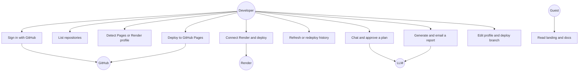

Use cases that look similar but must not be merged:

- **UC4 and UC5** both “deploy”, but they call different platforms, need different secrets, and fail differently.
- **UC7 and UC8** both “use the LLM”, but only UC7 has an approval gate. UC8’s pull-request tool is a separate, ungated use case and is drawn below as an extension that should have been a gate.

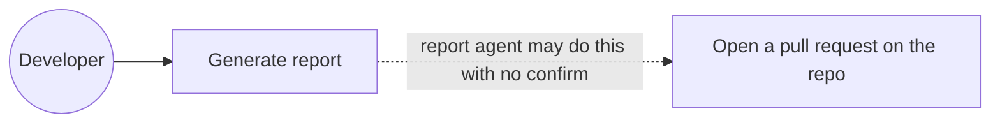

#### 4.6.3 Class and component diagram

The backend is not a rich domain model of many classes. It is a layered service design. Showing fifty empty classes would be decoration. The components that exist:

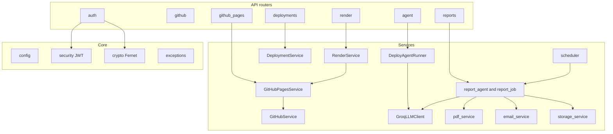

`RenderService.detect` reuses `GitHubPagesService`’s repository context so the two detectors do not fetch `package.json` twice in two different ways. That is the main reuse decision in the design.

The frontend has no classes of note. Each page has a script that calls `fetch` and writes DOM. Shared behaviour (theme, shell) sits in `app-shell.js`. The duplication of `BACKEND_API_URL` in each script is a design weakness, not a pattern to praise.

#### 4.6.4 Sequence diagrams

**Sign in**

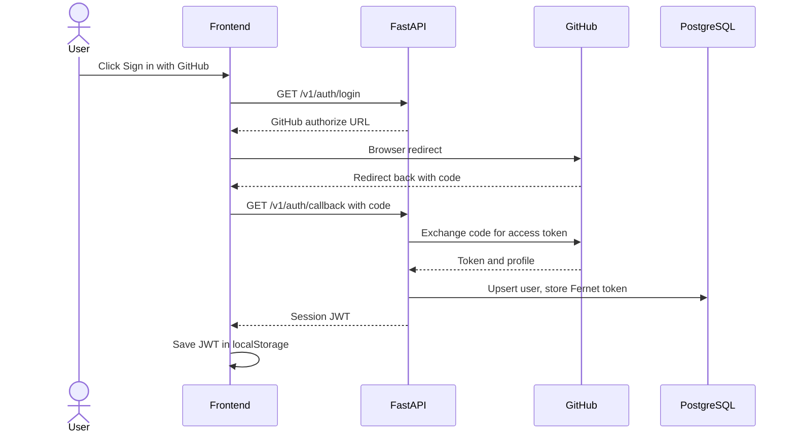

**GitHub Pages deploy**

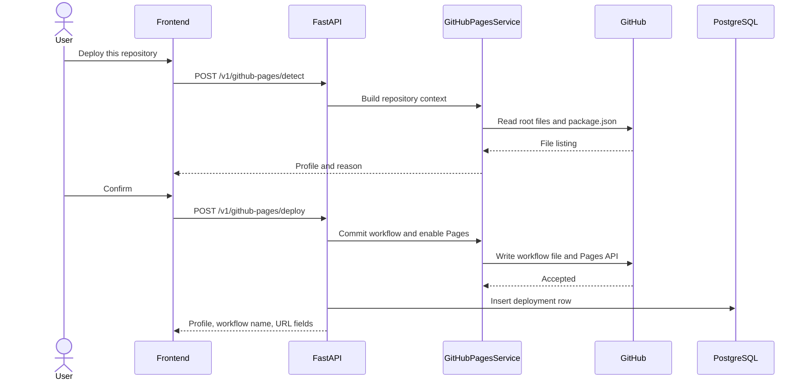

**Render deploy**

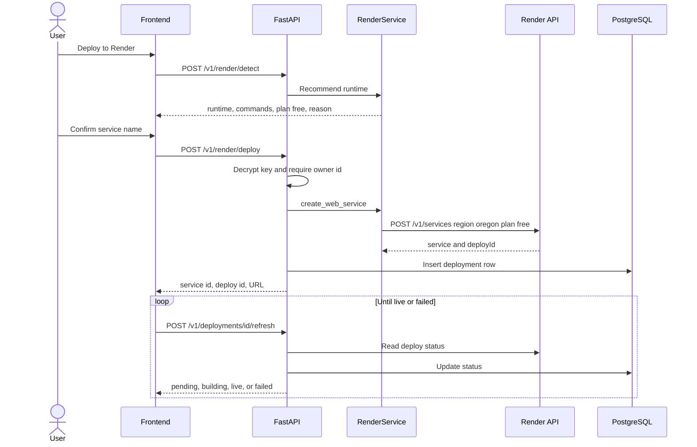

**Agent confirm gate**

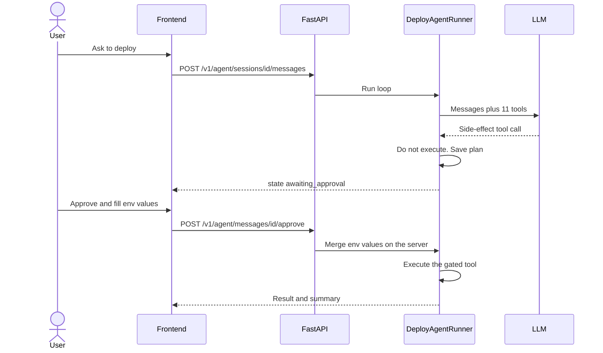

#### 4.6.5 E-R diagram

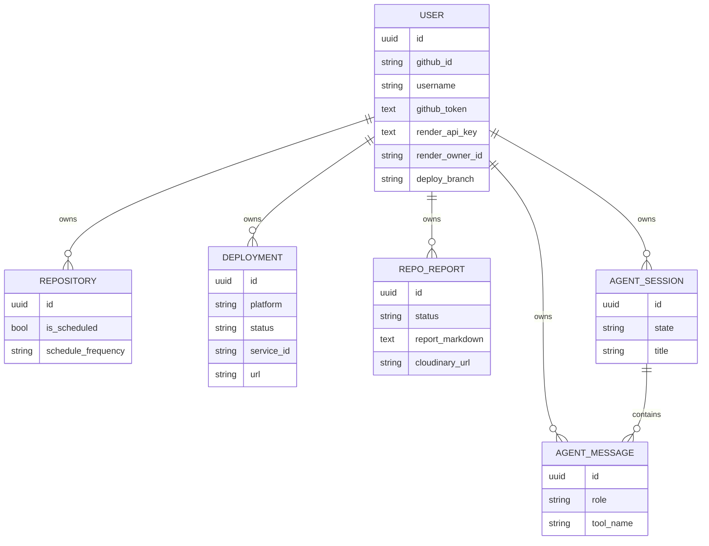

There is no foreign key from `deployments` to `repositories`. A deploy does not require a row in `repositories`. That matches the code: the history table is written by the deploy handlers, while `repositories` exists for the unused schedule flag. This is an honest modelling split, and it is also why scheduling cannot be inferred from deploy history.

#### 4.6.6 Data flow diagrams

**Level 0**

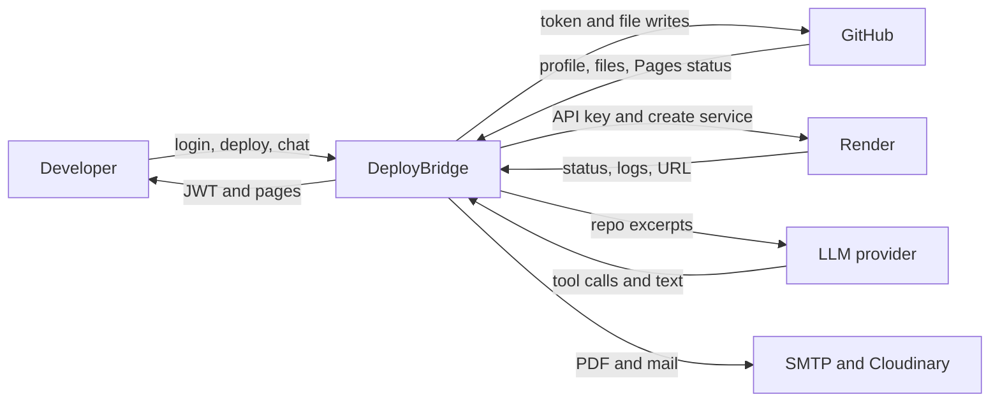

**Level 1**

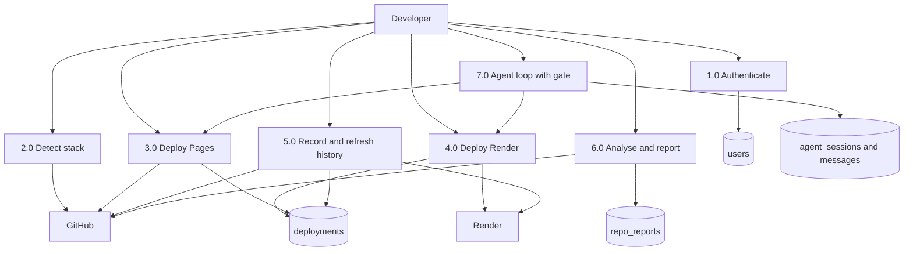

**Level 2 — Render create, because this is where the limits sit**

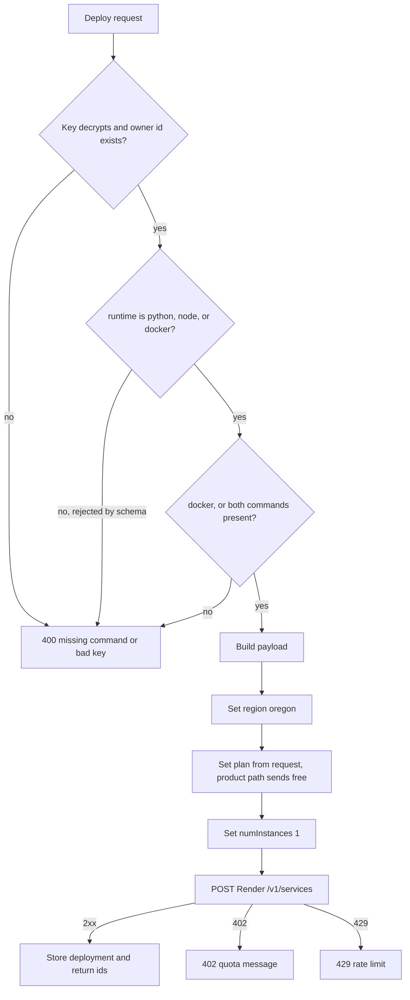

#### 4.6.7 Activity diagram

**Choose a platform**

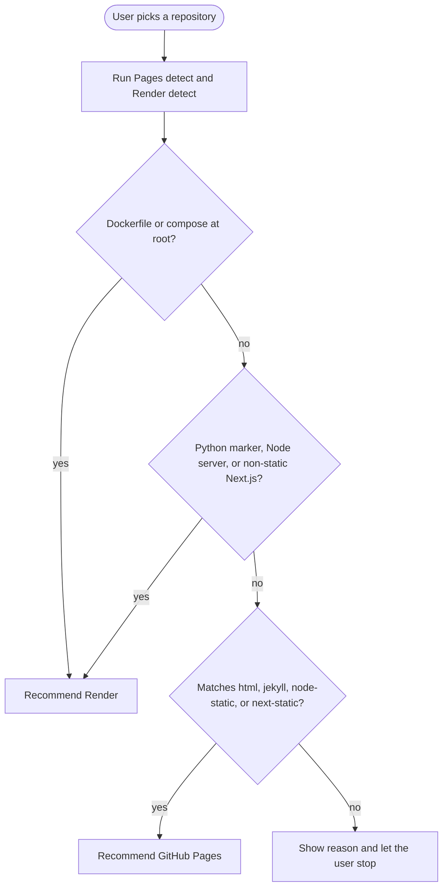

The recommendation is not a lock. The user can still attempt the other platform. If they force Pages on a server repository, Pages detection is designed to say so. If they force Render on a static site, Render’s last-resort rule can still pick docker or node. That may produce a service that builds and then does nothing useful. The reason string is the mitigation. It is not a proof.

**Deployment status**

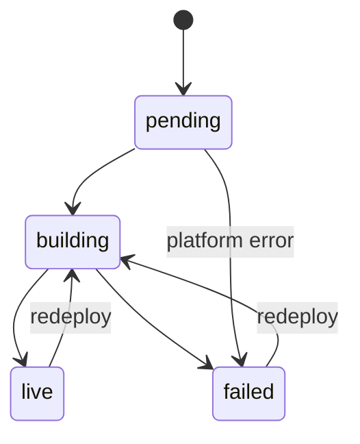

Refresh is pull-based. The browser asks our API, and our API asks Render or GitHub. There is no webhook from Render into DeployBridge. A tab that is closed does not update. `deployments.js` uses an 8-second auto-refresh interval while the page is open. That is a design limit: status is only as fresh as the open tab.

<div style="page-break-after: always;"></div>

# CHAPTER 5

## SYSTEM IMPLEMENTATION

### 5.1 Implementation Environment

#### 5.1.1 Multi-user environment

DeployBridge is multi-user in the database sense. Many GitHub users can each have a row, and queries are scoped by `user_id`. It is not multi-user in the template’s sense of “any visitor on the internet edits a shared tourism catalogue”.

What “multi-user” means here:

- Two students can sign in with two GitHub accounts and will not see each other’s deployment rows, if the filters stay in place.
- They share one backend process and one PostgreSQL database.
- They do not share GitHub tokens or Render keys. Each secret is stored on that user’s row.
- There is no tenant administrator.

The checked-in frontend is a local multi-user environment only by accident of the LAN: every browser is told to call `http://127.0.0.1:8000/v1`. Two browsers on the same laptop can log in as two users. Two browsers on two laptops cannot, unless that constant and CORS are changed. That is an implementation limit of the frontend, not of the API.

#### 5.1.2 GUI environment

The interface is a graphical web UI, not a CLI. It is built as a multi-page application:

- Public GUI: landing page (`index.html`) with GSAP 3.12.5 and Lenis 1.1.18, and a docs page.
- Application GUI: templates under `frontend/templates/`, styled with Tailwind’s Play CDN and CSS variables for light and dark theme (`localStorage` key `db_theme`).
- No Flash, no applet, no server-rendered component framework.

The GUI does not include an administration console. Section 5.3 explains what to do with the template’s “Admin Side Screen Shot” heading so that the submission stays honest.

#### 5.1.3 Runtime environment

| Process | How it is started | Listens |
|---|---|---|
| API | `uvicorn` on the FastAPI app in `backend/src/main.py` | Host and port from settings. Local demos use port 8000 |
| Database | PostgreSQL, URL from `DATABASE_URL` | Separate process |
| Scheduler | Started inside FastAPI lifespan, APScheduler, Monday 09:00 | In-process. Dies when Uvicorn dies |
| Frontend | Static files. A GitHub Actions workflow in `.github/workflows/deploy-frontend-pages.yml` publishes the frontend | GitHub Pages, or a local static server |
| External | GitHub, Render, LLM, optional SMTP and Cloudinary | The public internet |

Configuration is loaded from `backend/.env` through pydantic-settings. Names that matter:

| Variable | Required for | If missing |
|---|---|---|
| `DATABASE_URL` | Any real run | API cannot persist |
| `GITHUB_CLIENT_ID`, `GITHUB_CLIENT_SECRET` | Login | Login URL or token exchange fails |
| `GITHUB_TOKEN_ENCRYPTION_KEY` | Storing tokens | Fernet cannot encrypt |
| `JWT_SECRET_KEY` | Every protected route | Tokens cannot be signed |
| `JWT_ALGORITHM` | Token sign and verify | Must match on both operations |
| `ACCESS_TOKEN_EXPIRE_MINUTES` | Token life | Default 10000 if unset |
| `CORS_ALLOWED_ORIGINS` | Browser calls from a non-same origin | Browser blocks the frontend |
| `GROQ_API_KEY`, `GROQ_BASE_URL`, `GROQ_MODEL` | Reports and agent | Those features fail. Deploy still works |
| `CLOUDINARY_*` | Hosted PDF URL | PDF route may still build bytes locally if the library imports |
| `SMTP_*`, `REPORT_DELIVERY_ENABLED` | Email | Send-email fails |
| `APP_NAME`, `APP_VERSION`, `DEBUG`, `LOG_LEVEL` | Labels and logs | Defaults exist for several of these |

The name `GROQ_*` is kept even when the base URL is Gemini. Implementers should not “fix” the name in a report and then fail to match the code.

#### 5.1.4 Modules as implemented

| Module | Backend | Frontend | External |
|---|---|---|---|
| Identity | `api/v1/auth.py`, `core/security.py`, `core/crypto.py` | `auth.js`, `profile.js` | GitHub OAuth |
| Repo browser | `api/v1/github.py`, `services/github.py` | `overview.js`, `repositories.js` | GitHub REST |
| Pages | `api/v1/github_pages.py`, `services/github_pages.py`, four YAML templates | Deploy modal in `repositories.html` | GitHub Contents and Pages API, Actions |
| Render | `api/v1/render.py`, `services/render.py` | Same modal, second path | Render REST |
| History | `api/v1/deployments.py`, `services/deployment_service.py` | `deployments.js` | Both platforms on refresh |
| Reports | `api/v1/reports.py`, `report_agent.py`, `pdf_service.py`, `email_service.py`, `storage_service.py`, `scheduler.py` | `reports.js` | LLM, SMTP, Cloudinary |
| Agent | `api/v1/agent.py`, `services/deploy_agent.py` | `agent.js` | LLM, then Pages or Render after approval |
| Settings | profile patch and Render connect routes | `settings.js` | Render owners API |

### 5.2 User Side Screen Shot

**Screenshot status.** This file does not contain captured screenshots. A live capture needs a running API, a GitHub OAuth app, and, for Render screens, a real API key. Those were not exercised while writing this report. Each subsection is a screen inventory taken from the HTML and JavaScript that ship in the repository. Before final printing, paste a live screenshot in the box. Do not paste an AI-generated picture and call it a screenshot.

The user side is every screen a signed-in developer sees, plus the public pages a guest sees. There is no second “customer” role.

#### 5.2.1 Screen map

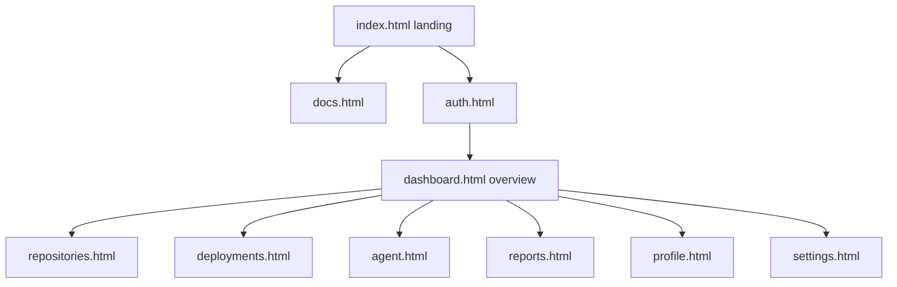

| Screen | File | Who | Main action | API it calls |
|---|---|---|---|---|
| Landing | `frontend/index.html` | Guest | Read, go to sign in or docs | None for the hero. Theme from `localStorage` |
| Docs | `docs.html` | Guest | Read | None required |
| Auth | `templates/auth.html` | Guest becoming user | Start OAuth, finish callback | `GET /v1/auth/login`, `GET /v1/auth/callback` |
| Overview | `templates/dashboard.html` | User | See recent repositories | `GET /v1/github/user`, `GET /v1/github/user/repos?sort=updated&per_page=50` from `overview.js`. An inline script on the dashboard also requests `per_page=4` |
| Repositories | `templates/repositories.html` | User | Detect and deploy | GitHub info, Pages detect/deploy, Render detect/deploy |
| Deployments | `templates/deployments.html` | User | History, refresh, redeploy, domain | `GET /v1/deployments?page=&page_size=10`, refresh, redeploy, delete, Render custom-domain routes |
| Agent | `templates/agent.html` | User | Chat, approve, cancel | `/v1/agent/sessions`, messages, approve |
| Reports | `templates/reports.html` | User | List and open reports | `/v1/reports/history` and related |
| Profile | `templates/profile.html` | User | See and edit profile fields we store | `GET` and `PATCH /v1/auth/profile` |
| Settings | `templates/settings.html` | User | Deploy branch, Render connect | profile patch, `/v1/render/connect`, `/v1/render/status` |

#### 5.2.2 Landing page

**Insert live screenshot of `index.html` here.**

What the source shows: a marketing page titled “DeployBridge - Ship Code Faster”, theme applied before paint so the page does not flash the wrong colours, Tailwind loaded from the CDN, GSAP 3.12.5 for motion, Lenis 1.1.18 for scroll. It does not call the API to list repositories. A guest who never signs in can still read it.

#### 5.2.3 Sign-in page

**Insert live screenshot of the GitHub sign-in button, and a second shot of the callback completing.**

Behaviour from `auth.js`:

1. The page requests `GET /v1/auth/login`.
2. If the backend is down, the script alerts that it could not connect to `http://127.0.0.1:8000/v1`.
3. On return, it sends the `code` query parameter to `GET /v1/auth/callback`.
4. The JWT is stored in the browser. Later pages send it as `Authorization: Bearer`.

There is no email field and no password field. A screenshot that shows a username/password form is not this application.

#### 5.2.4 Overview

**Insert live screenshot of the dashboard after login.**

The signed-in home shows the GitHub user and a short repository list. `overview.js` asks for 50 repositories sorted by update time. The dashboard template also contains an inline fetch for 4 repositories. Both exist in the tree. A screenshot should be checked against which list is actually visible, because the two calls are a duplication, not two designed widgets with different jobs. That duplication is a limitation (Chapter 7), not a feature called “top 4 and full 50”.

#### 5.2.5 Repositories and the deploy modal

**Insert live screenshot of the repository list, then the detect modal, then a success or error result.**

This is the main user screen. From `repositories.html` and `repositories.js` the modal:

- shows the detected Render runtime;
- shows the plan, which the detect API fills as `free`;
- lets the user edit the build command;
- sends `service_name`, `runtime`, `build_command`, `plan: detectData.plan || "free"`, and env-var suggestions.

What the screenshot will not show, because the controls are not there:

- a region dropdown (the server writes `oregon`);
- a plan dropdown (the value is display-only, then posted back);
- an instance-count field.

If a Render deploy fails because the free workspace is full, the screenshot of the error should show the 402 message. That is a successful capture of a limitation, and it belongs in the report.

#### 5.2.6 Deployments

**Insert live screenshot of the history list, and one shot of a card in `building` or `failed`.**

`deployments.js` loads `page_size=10`, refreshes a row, can redeploy, can delete the history row, and can add a Render custom domain. Auto-refresh interval is 8000 ms. The card is expected to show platform, status, URL, branch, and profile when those fields are present.

A Pages URL on the card may be the real Pages URL or the assumed `https://{owner}.github.io/{repo}` fallback written in `deployment_service.py` when status is live and the URL is still empty. A screenshot of a 404 at that URL is not automatically a frontend bug. Project sites and user sites on GitHub do not all use that exact shape. Chapter 7 states this.

#### 5.2.7 Agent

**Insert live screenshot of a chat, and a second shot of the approve card before any deploy happens.**

The approve card is the screen that proves the confirm gate. It should be captured in the `awaiting_approval` state, with the human summary produced by `_summarize_plan_step`, for example “Create Render service 'notes-api' (python, free plan, auto-deploy on) with 2 env var(s)” or “Deploy owner/repo to GitHub Pages (profile=auto)”. Env-var values are typed into the card and posted to the approve route. They are not supposed to appear as an earlier assistant message.

A screenshot of a deploy that happened with no approve card is a defect, not the designed path, unless it came from the repositories page (which deploys directly, by design) or from the report agent (which is the ungated path).

#### 5.2.8 Reports, profile, settings, docs

**Insert one live screenshot of each.**

| Screen | What a correct screenshot contains | What would mean the shot is from a different app |
|---|---|---|
| Reports | A list of generated analyses, status, and a Markdown body rendered with `marked` | A CMS article editor |
| Profile | GitHub username, email, avatar URL that we stored | A password-change form |
| Settings | Deploy branch field, Render connect / status / disconnect | A billing page or a user-admin table |
| Docs | The in-repo documentation page | The tourism sample |

### 5.3 Admin Side Screen Shot

#### 5.3.1 There is no admin side

This heading is required by `SupportDocs/6_Chapters.docx`. The sample under that heading is a tourism administrator who logs in and inserts hotels. **DeployBridge does not have that module.** There is no `/admin` route, no `is_admin` column, no admin username table, and no screen that lists every user.

Claiming an admin panel in the viva, or inserting a screenshot from another project under this heading, would make the report false. The honest content of section 5.3 is: what an operator can see, and where that view lives.

| Template expectation | What DeployBridge has instead |
|---|---|
| Admin login | Does not exist. The only login is GitHub OAuth |
| Admin inserts and deletes public content | Does not exist. We do not host that content |
| Admin reads every user’s data | Does not exist in the API. A person with database access can, because they have PostgreSQL, not because we built a screen |
| Admin approves a user’s deploy | Does not exist. The user approves their own agent plan |

#### 5.3.2 Operator views that do exist, and are not an admin product

These are the screenshots a team may place under this heading if each image is captioned with what it really is.

| View | Where it lives | Caption that must be used | Why it is not “the admin module” |
|---|---|---|---|
| Settings | `templates/settings.html` | “Signed-in user’s own settings, not an admin console” | It edits that user’s deploy branch and Render key |
| Profile | `templates/profile.html` | “Signed-in user’s own profile” | Same user, no user list |
| FastAPI docs | `http://127.0.0.1:8000/docs` when enabled | “API documentation generated by FastAPI” | It is a developer aid. It still requires a bearer token for protected routes |
| Render dashboard | `dashboard.render.com`, outside our app | “Render’s own dashboard, opened from the link we store” | We link to it. We did not build it |
| GitHub repository settings | `github.com`, outside our app | “GitHub Pages and Actions, which actually build the site” | Same |
| Server log | The terminal running Uvicorn | “Process log. `print` and logger output, not an audit UI” | No log viewer was built |
| Database | `psql` or a desktop client | “Direct database access by whoever has the password” | Not a feature of the website |

**Insert live screenshots only of the rows above, each with the caption in the table.**

If the examiner’s copy of the template insists on the words “Admin Side”, leave the words, and put the paragraph in 5.3.1 directly underneath. An empty section would look unfinished. A fake admin login would be worse.

#### 5.3.3 What a database operator would see

A person with `DATABASE_URL` can read every table in section 4.6.1. They will see ciphertext in `github_token` and `render_api_key`, not the raw secrets, unless they also have `GITHUB_TOKEN_ENCRYPTION_KEY`. They will see report Markdown, which may quote the user’s source code, and agent messages, which may quote file contents the agent read. That is the real “admin” power, and it is PostgreSQL’s power. It is a reason to keep the database password off the laptop that is passed around the lab, not a reason to draw an admin use case we did not implement.

### 5.4 Sample Coding

The samples are short and taken from the implementation. They are here to show the style of the system: thin routers, a service class for Render, a hand-written agent loop, and a frontend that calls a fixed host. Line numbers drift. The file path is the stable reference.

#### 5.4.1 Health check — the smallest route

File: `backend/src/api/v1/health.py`

```python
@router.get('/health')
def health():
    return {
        "status": "Ok",
    }
```

Mounted at `/v1/health`. It does not touch the database. A process can be “Ok” while PostgreSQL is down. That is acceptable for a liveness check and insufficient for a readiness check.

#### 5.4.2 Render create — where the limits are implemented

File: `backend/src/services/render.py`, inside `create_web_service`. The payload is built in code, not chosen from a region screen.

```python
service_details: dict[str, Any] = {
    "runtime": request.runtime,
    "plan": request.plan,
    "region": "oregon",  # default; user can change in Render dashboard
    "numInstances": 1,
}
```

`request.plan` is typed as a set of Render plan names, so a hand-written API call could send `starter`. The repositories page does not. It posts `detectData.plan || "free"`, and detect sets `plan="free"`. The region is not even a field on the request model. After create, the user can change region only in Render’s dashboard, which may mean recreating the service. The comment in the code is accurate about that workaround. It is not a region selector.

Native runtimes are rejected early if commands are missing:

```python
if not request.build_command or not request.start_command:
    raise RenderError(
        message="Missing build/start command.",
        detail=(
            f"Runtime '{request.runtime}' requires both buildCommand and "
            "startCommand. Run /v1/render/detect first to pre-fill them, "
            "or pass them explicitly in the deploy request."
        ),
        status_code=400,
    )
```

Docker takes a different branch and sends `dockerfilePath` and `dockerContext` instead. Mixing both, the module comment says, is a 422 from Render. The code avoids that mix.

Free-tier failure is mapped, not swallowed:

```python
if status == 402:
    raise RenderError(
        message="Render free-tier limit reached.",
        detail="Your Render workspace hit a plan quota (e.g. 25 services on the "
               "free tier, 750 instance-hours/month, or 500 build minutes). "
               "Upgrade your plan or delete an unused service.",
        status_code=402,
    )
```

The numbers in that string are examples inside our error text. They are not a quota table we recalculated. If Render’s marketing numbers change, this string can be wrong while the HTTP status remains the right signal.

#### 5.4.3 Deploy-agent loop — not LangChain

File: `backend/src/services/deploy_agent.py`

```python
MAX_STEPS = 8
MAX_OUTPUT_TOKENS = 4000
MAX_TOOL_RESULT_CHARS = 30000
```

The loop is a normal `for step in range(MAX_STEPS)` over the OpenAI-compatible client, temperature 0.2. Read-only tools run immediately. If the model asks for a side-effect tool, the runner stores a plan and returns `awaiting_approval` instead of calling Render or GitHub. The next user action is `POST /v1/agent/messages/{id}/approve` with `approved: true` or `false`. On approve of a Render deploy, env-var values from the request body are merged on the server into the tool arguments. They are not replayed into the model transcript as the secret values.

The report agent (`report_agent.py`) has the same step cap and a smaller tool list: `list_file_tree`, `read_file`, `create_pull_request`. The third tool calls `GitHubService.create_file_and_pull_request` inside the loop. There is no approve route on that path. Sample code for that call is intentionally not praised here. It is the defect L-R5 in Chapter 7.

#### 5.4.4 Frontend call — the host is fixed

File: `frontend/js/auth.js` (the same constant appears in `agent.js` and `deployments.js`; `overview.js` inlines the URL)

```javascript
const BACKEND_API_URL = "http://127.0.0.1:8000/v1";
```

A deployment of the frontend to GitHub Pages does not change this line. The Pages site will still ask the user’s laptop for port 8000. That is why section 5.1 called the published frontend a local tool unless the constant is edited.

#### 5.4.5 Pages URL fallback

File: `backend/src/services/deployment_service.py`

When a Pages deployment is marked live and `url` is still empty, the service assigns:

```python
f"https://{deployment.owner}.github.io/{deployment.repo}"
```

That shape is right for a project site on a user or organisation that does not use a custom domain, and wrong for a repository named `{owner}.github.io` (the user site, which is served at the apex) and wrong once a custom domain is the real URL. The fallback is a convenience. It is not a read of the Pages API in every case.

<div style="page-break-after: always;"></div>

# CHAPTER 6

## TESTING

### 6.1 Testing Plan

#### 6.1.1 What testing means for this project

The course template says testing is a large share of effort, that tests should trace to requirements, and that an independent party should test. The repository supports a smaller, clearer statement.

- Automated tests exist: **24** async tests under `backend/tests/api/`.
- They run against the FastAPI app with an in-memory SQLite database (`sqlite+aiosqlite:///:memory:` in `tests/conftest.py`).
- GitHub and Render calls are mocked in the tests that would otherwise leave the machine.
- There is no recorded independent test team, no bug tracker export, and no coverage percentage checked in.
- A manual script, `backend/verify_integrations.py`, is the place for live checks. It is not part of the 24.

So the plan that was followed is **API tests for routing, auth, and a few mocked happy paths**, plus **manual checks when a developer had credentials**. It is not a 30–40 percent formal test effort, and this report will not invent one.

#### 6.1.2 Levels

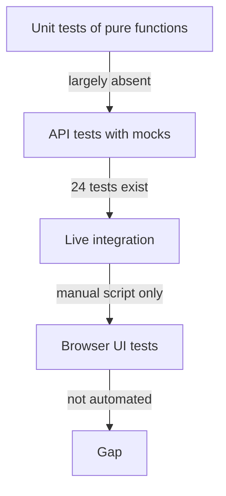

| Level | Planned intent | What was actually done |
|---|---|---|
| Unit | Pure detection rules, URL fallback, plan summary | Not separated. Detection is not given a table-driven test file |
| API | Every route at least unauthorised, plus one success | Partial. See 6.2 |
| Integration | Real GitHub and Render | Manual only |
| UI | Click-through of each template | Not automated. No Playwright or Selenium config is in the repo |
| Security | Token not returned, cross-user id access | Partially implied by auth tests. No cross-user test was found |
| Performance | Not a goal | Not done |

#### 6.1.3 Rules we can actually keep

| Rule from the template | How it applies here |
|---|---|
| Tests should trace to requirements | The tables in 6.2 name the FR id |
| Tests should be planned before testing begins | Not evidenced. Tests appear in the 19 September commits, after the features |
| An independent party should test | Not evidenced. The authors tested their own API |
| A passing suite means the product works | **Rejected.** SQLite and mocks cannot prove a Render create |

#### 6.1.4 Environments

| Environment | Database | External calls | Used for |
|---|---|---|---|
| pytest | SQLite memory | Mocked | The 24 tests |
| Developer laptop | PostgreSQL | Live, if `.env` is filled | Manual demo |
| CI | Not described as a required check in the application workflow we read | The workflow we saw publishes the frontend | Do not claim a green badge for the API tests unless one is configured |

#### 6.1.5 Entry and exit

Entry for a manual demo: migrations applied, OAuth callback correct, one writable repository, and, for Render, a key that `GET /v1/owners` accepts.

Exit for this report’s testing claim: the 24 tests are listed by their real function names, and every important untested behaviour is listed as not automated. Exit is not “zero defects”.

### 6.2 Test case Modules

The module names follow the API, not the tourism template’s “User Management” and “Manage Attractions”. Under each module, automated cases are listed first, then manual cases that a viva demo should still perform. **Status** is the truth as of the baseline. “Automated” means the function exists in `backend/tests/api/`. It does not mean the live platform was called.

#### 6.2.1 Health module

| Field | TC_HEALTH_001 |
|---|---|
| Requirement | FR27 |
| Automated as | `test_health_check` |
| Scenario | Process responds on the health route |
| Pre-conditions | App imported, no login |
| Steps | `GET /v1/health` |
| Expected | HTTP 200 and body status Ok |
| Not covered | Database down, dependency failure |

#### 6.2.2 Authentication module

| ID | Automated function | Scenario | Expected | Maps to |
|---|---|---|---|---|
| TC_AUTH_001 | `test_get_github_login_url` | Login URL can be requested | A GitHub authorize URL is returned | FR2 |
| TC_AUTH_002 | `test_github_callback` | Callback with mocked token and profile | User is stored, session token returned | FR3 |
| TC_AUTH_003 | `test_get_user_profile_unauthorized` | Profile without bearer token | 401 or 403 | NFR1 |
| TC_AUTH_004 | `test_get_user_profile` | Profile with a valid test JWT | The test user’s fields | FR4 |
| TC_AUTH_005 | `test_update_user_profile` | Patch profile | Updated fields | FR4 |
| TC_AUTH_006 | `test_refresh_session` | Refresh with a valid token | A new session token | FR5 |
| TC_AUTH_007 | `test_logout` | Logout | Client success. Server does not keep a deny-list | FR5 |

Fixture behind these tests: `test_user` inserts `github_id=12345`, username `testuser`, token string `fake_encrypted_token`, scope `repo`. The fixture does **not** insert a real Fernet token or a Render key. Tests that need Render decrypt are mocked at the dependency.

| Field | TC_AUTH_008 (manual) |
|---|---|
| Status | Not automated |
| Scenario | Real GitHub consent screen, then a second browser with no token |
| Expected | First browser reaches the dashboard. Second browser is refused |
| Why it matters | The mock callback cannot prove the OAuth app’s callback URL is right |

#### 6.2.3 GitHub data module

| ID | Automated function | Scenario | Expected | Maps to |
|---|---|---|---|---|
| TC_GH_001 | `test_get_repository_info` | Repo info with GitHub service mocked | 200 and the mocked shape | FR7 |
| TC_GH_002 | `test_get_repository_info_unauthorized` | No token | Unauthorised | NFR1 |

Not automated: `GET /v1/github/user` and `GET /v1/github/user/repos` against a real token, pagination, and a repository the token cannot see (should be 404 from GitHub, mapped, not a stack trace).

#### 6.2.4 GitHub Pages module

| ID | Automated function | Scenario | Expected | Maps to |
|---|---|---|---|---|
| TC_PAGES_001 | `test_detect_github_pages_profile` | Detect with service mocked | A profile and reason | FR8 |
| TC_PAGES_002 | `test_deploy_to_github_pages` | Deploy with service and deployment-create mocked | Success payload, history write mocked | FR9, FR18 |
| TC_PAGES_003 | `test_add_pages_custom_domain` | Add domain, mocked | CNAME or A guidance in the response shape | FR10 |
| TC_PAGES_004 | `test_verify_pages_custom_domain` | Verify, mocked | Status string | FR10 |

| Field | TC_PAGES_005 (manual) |
|---|---|
| Status | Not automated |
| Scenario | Deploy a real public HTML repository from the modal |
| Expected | A workflow file appears in the repo, Actions runs, Pages URL loads |
| Data | A repo with `index.html` at the root, branch `main` |
| Fail that must be recorded, not hidden | If the live URL 404s while our row says live, check the `{owner}.github.io/{repo}` assumption before blaming Actions |

| Field | TC_PAGES_006 (manual) |
|---|---|
| Status | Not automated |
| Scenario | Point detect at a FastAPI repository |
| Expected | Pages path does not pretend it is a static site. Render is the recommendation |
| Maps to | R12 |

#### 6.2.5 Render module

This module needs the most care in a viva, because the limits are easy to demo by accident.

| ID | Automated function | Scenario | Expected | Maps to |
|---|---|---|---|---|
| TC_REN_001 | `test_connect_render` | Connect with validate mocked | Connected, owner id returned, key not echoed | FR11 |
| TC_REN_002 | `test_render_status` | Status for the test user | Connected flag without the secret | FR12 |
| TC_REN_003 | `test_disconnect_render` | Disconnect | Key cleared | FR13 |
| TC_REN_004 | `test_list_render_services` | List with key dependency and list mocked | A list shape | FR16 |

Not automated, and should be said out loud if asked “is Render tested?”:

| ID | Scenario | Steps | Expected | Why this is a limit test |
|---|---|---|---|---|
| TC_REN_005 | Detect a Python repo | POST detect on a repo with `requirements.txt` | runtime python, plan free, a uvicorn-style start command, a reason | Confirms detect, not create |
| TC_REN_006 | Detect a Dockerfile | Same, with a Dockerfile at root | runtime docker, dockerfile path set, build and start empty | Rule 1 of detect |
| TC_REN_007 | Create on the product path | Deploy from the modal | Request that hits our server has region absent, plan free. Render service is created in oregon | Proves C4. Inspect the payload or the Render dashboard, not only our UI |
| TC_REN_008 | Missing start command | POST deploy with runtime python and no commands | 400, message about build and start | FR15 negative |
| TC_REN_009 | Bad API key | Connect with a random string | 400, “Invalid Render API key”, no ciphertext stored for a failed validate | FR11 negative |
| TC_REN_010 | Quota | Create when the workspace is over the free quota | 402 and the free-tier message | R2. Do not “fix” this by catching 402 and reporting success |
| TC_REN_011 | Cold start | Open a free service URL after it has slept | First hit is slow or 502 from Render, then the app loads. Our row may already say live | R10. This is platform behaviour of the plan we always select |
| TC_REN_012 | Logs too early | Fetch logs in the first seconds | Empty string, not an exception. The service treats 404 from the log endpoint as “not yet” | Documented in `get_deploy_logs` |
| TC_REN_013 | Unsupported runtime | POST deploy with runtime `go` | 422 from our schema, not a Render service | The schema comment that says otherwise is wrong |
| TC_REN_014 | Team-only key | Connect a key with no personal workspace | First team workspace is used. No picker | Operational surprise, not a crash |
| TC_REN_015 | Custom domain | Add a domain and verify before DNS exists | Domain row created, verification not yet verified, CNAME target shown | FR17. We cannot pass verify by wishing |

#### 6.2.6 Deployment history module

| ID | Automated function | Scenario | Expected | Maps to |
|---|---|---|---|---|
| TC_DEP_001 | `test_get_deployments` | List with auth | 200, current user’s page | FR19 |
| TC_DEP_002 | `test_get_deployments_unauthorized` | No token | Unauthorised | NFR1 |

Not automated: get-by-id, refresh against Render, redeploy, delete, and a second user requesting the first user’s id (must be 404, not the row).

| Field | TC_DEP_003 (manual) |
|---|---|
| Status | Not automated |
| Scenario | Refresh a Render row until it leaves `building` |
| Expected | Status becomes live or failed. On failed, error text is stored. Logs may be empty for a few seconds |
| Interval | The page polls about every 8 seconds while open |

#### 6.2.7 Reports module

| ID | Automated function | Scenario | Expected | Maps to |
|---|---|---|---|---|
| TC_REP_001 | `test_get_reports` | History with auth | 200 | FR20 |
| TC_REP_002 | `test_get_reports_unauthorized` | No token | Unauthorised | NFR1 |

Not automated: generate against a live model, PDF bytes, email send, delete, and the Monday scheduler. The scheduler cannot be shown with current data, because no row has `is_scheduled` set by the API. A manual test that updates the column in SQL would prove the job, and should be labelled as a database poke, not as a product feature.

| Field | TC_REP_003 (manual, and a safety test) |
|---|---|
| Status | Not automated |
| Scenario | Generate a report on a repository the model might “fix” |
| Expected today | The report agent may call `create_pull_request` and open a PR with no approve card |
| Expected if the defect is fixed later | No PR unless the user confirms |
| Data | Use a throwaway repository, never a repository the team cannot revert |

#### 6.2.8 Deploy agent module

| ID | Automated function | Scenario | Expected | Maps to |
|---|---|---|---|---|
| TC_AG_001 | `test_get_agent_sessions` | List sessions | 200 | FR23 |
| TC_AG_002 | `test_get_agent_sessions_unauthorized` | No token | Unauthorised | NFR1 |

Not automated, and central to the claim “the agent cannot deploy alone”:

| ID | Scenario | Steps | Expected |
|---|---|---|---|
| TC_AG_003 | Read-only question | Ask which files suggest the stack | Tools such as `detect_stack` or `read_repo_file` run. Session returns to idle. No Render service is created |
| TC_AG_004 | Deploy request | Ask to deploy to Render | State becomes `awaiting_approval`. No `POST /v1/services` yet |
| TC_AG_005 | Cancel | Approve route with `approved: false` | Plan is not executed. User is told it was cancelled |
| TC_AG_006 | Approve | Approve with env values filled | Tool runs. Values are not required to have been in the earlier chat text |
| TC_AG_007 | Step cap | A prompt that keeps calling tools | Loop stops at 8 and forces a summary |
| TC_AG_008 | Other user’s session id | Call get-session with another user’s id | Not found, not the transcript |

#### 6.2.9 Traceability summary

| Requirement group | Automated tests | Manual tests still required |
|---|---|---|
| Health | 1 | Readiness is untested |
| Auth | 7 | Live OAuth |
| GitHub data | 2 | Live repo list |
| Pages | 4 | Live workflow run, mis-classification |
| Render | 4 | TC_REN_005 to TC_REN_015 |
| History | 2 | Refresh, redeploy, cross-user |
| Reports | 2 | Live model, PDF, email, ungated PR |
| Agent | 2 | Approve, cancel, step cap |
| Scheduler FR22 | 0 | Cannot be demoed from the UI |

24 automated tests. That count is the number of `test_` functions in `backend/tests/api/`, not a count of assertions, and not a count of requirements.

<div style="page-break-after: always;"></div>

# CHAPTER 7

## Limitation of Project

### 7.1 Limitation of Project

A limitation in this report is something the software does not do, or does only under a condition the user can hit. It is not a wish-list copied from the tourism template (“add hotel booking”). Each item says where it lives in the code, so it can be checked.

```mermaid
mindmap
  root((Honest limits))
    Product
      Two platforms
      Four Pages profiles
      Render free and oregon
      No admin role
      Schedule flag unused
    Render platform
      Quota and spin down
      Logs lag
      One workspace choice
    Engineering
      Localhost API URL
      JWT in localStorage
      Ungated report PR
      Thin tests
      Divergent requirements
```

#### 7.1.1 Product boundaries

| ID | Limitation | Evidence | What a user feels |
|---|---|---|---|
| L1 | Only GitHub Pages and Render | Routers stop at those two. No Vercel, Netlify, AWS, or SSH deploy | Any other host is out of scope |
| L2 | Only four Pages profiles: `html`, `jekyll`, `node-static`, `next-static` | `SUPPORTED_PROFILES` and four files in `templates/github_pages/` | Hugo, Sphinx, or a custom build is not detected as its own profile |
| L3 | Render runtime through this API is only `python`, `node`, or `docker` | `RenderRuntime = Literal["python", "node", "docker"]` | A Go or Ruby service cannot be created by sending `runtime=go`. Validation fails first |
| L4 | The schema comment over-promises | The comment above that Literal says elixir, go, ruby, rust, and image can be passed explicitly | They cannot. The comment is stale. The Literal is the API |
| L5 | No monorepo path | Detect reads the repository root context | A server in `/backend` with a static site at `/` can be classified from the root only |
| L6 | No admin, no roles, no audit screen | User model has no role column | A guide cannot “log in as admin” to see all students |
| L7 | Scheduled reports are not a delivered feature | `scheduler.py` queries `is_scheduled == True`. No API writes that flag. Frequency column is ignored by the cron, which is fixed to Monday 09:00 | The settings page cannot turn on a weekly report |
| L8 | Deployment history is not a second source of truth for the live site | We store a row. GitHub and Render can change outside us. Refresh is pull, and only while the tab is open | A service deleted in the Render dashboard can still appear until refresh or delete |
| L9 | One plan card per pause | The agent loop stops on the side-effect call | It does not queue a long unattended pipeline |
| L10 | No streaming | The message endpoint returns when the loop pauses or ends | The chat looks idle during the model call |
| L11 | English only, no offline mode | No locale files, every detect call needs GitHub | A lab without internet cannot demo the core flow |
| L12 | Health does not check dependencies | `health()` returns Ok | A monitor can go green while login is broken |

#### 7.1.2 Render deployment limitations

These are separated because they are the limits a demo is most likely to hit, and because some of them are our choices while others are Render’s.

**Limits we coded, and could change later**

| ID | Limitation | Where | Detail |
|---|---|---|---|
| R-L1 | Region is always `oregon` | `RenderService.create_web_service` sets `"region": "oregon"` | The deploy request schema has no region field. The UI has no region control. A user in India still gets Oregon unless they later change it in Render’s own dashboard. Latency and data-residency are whatever Oregon implies |
| R-L2 | The product path always requests the free plan | `detect` returns `plan="free"`. The modal shows that text and posts it back | The schema allows starter and above. The button the user has does not send them. Free-plan behaviour is therefore the behaviour of the product |
| R-L3 | Instance count is always 1 | `"numInstances": 1` in the same payload | No scale-up, no scale-to-zero setting of our own. Free tier spin-down is Render’s policy on top of this |
| R-L4 | Auto-detect will not choose go, ruby, rust, elixir, or a prebuilt image | `_detect_runtime` returns only python, node, or docker | Even the fallback is docker, not “ask the user to pick from Render’s full list” |
| R-L5 | Native runtimes need both commands | 400 if either is missing | A user who clears the start command in the modal cannot deploy. That is correct relative to Render, and it surprises people who are used to a platform inferring the start command |
| R-L6 | One workspace is chosen at connect | Personal `type=user` owner, else the first team owner | A user in two workspaces cannot pick. The key itself can see every workspace the key can see; we cache one id |
| R-L7 | We do not pre-check quota | 402 is handled after Render refuses | The modal can look ready and still fail |
| R-L8 | The deploy modal does not warn about sleep or cold start | No such copy in the repositories template | The first visit to a free URL can look like our deploy failed |
| R-L9 | Logs can be empty at the start | `get_deploy_logs` turns a 404 into an empty string and comments that the free tier may return 0 lines while the build container boots | An agent or a user who reads logs immediately may conclude there is no error when the error has not been emitted |
| R-L10 | Custom domain verify cannot be forced | We add the domain and derive a CNAME from the `onrender.com` host. Render’s API gives verification status, not a full DNS recipe beyond what we derive | Until the user’s DNS host serves that record, verify stays unverified. Propagation is outside our process |
| R-L11 | Service URL exists before the build is live | Our own schema comment: the URL is assigned at create and can return 502 until the deploy is live | Opening the URL in the success toast can show Render’s 502. That is not the same as “deploy failed” |
| R-L12 | IP allow-lists | 403 mapper mentions a workspace IP allow-list | If the Render workspace only allows some egress IPs, DeployBridge’s server must be on that list. A laptop IP that changes will break connect or create |

**Limits that belong to Render’s free plan, which we always select**

These are platform limits. They are included because the product does not offer a way around them in the UI. The figures in our 402 string are quoted as examples the code already shows the user, not as a measurement we made on 25 September 2026.

| ID | Platform limit | What the user sees |
|---|---|---|
| R-P1 | Free web services spin down after a period without traffic | Slow first request, or a gateway error, on a service our database already calls live |
| R-P2 | Monthly instance-hours and build minutes, and a cap on how many free services a workspace may hold | HTTP 402 from Render, which we turn into “Render free-tier limit reached” plus the example text about 25 services, 750 instance-hours, and 500 build minutes |
| R-P3 | Free-tier bandwidth, disk, and build-time caps on Render’s side | A build fails in Render. We can store the failed status and, once logs exist, show them. We cannot extend Render’s builder |
| R-P4 | Rate limits | HTTP 429, mapped with `RateLimit-Limit` and `RateLimit-Reset` when Render sends those headers |
| R-P5 | Render, not we, stores the runtime env vars after create | We send them at create. Rotating them later is a Render dashboard or a later API call we did not expose as a general env editor |
| R-P6 | Region capacity and registry pulls happen on Render’s network | A Docker deploy can fail because the Dockerfile’s base image cannot be pulled. The reason is in Render’s log, not in our Python traceback |

**What Render deployment does do, so the limitation section is not read as “Render is unimplemented”**

- Connect, disconnect, and status.
- Detect python, node, and docker, with a reason string.
- Create a web service, return service id, deploy id, service URL, and dashboard URL.
- List and read services, redeploy, fetch logs when Render has them.
- Add and verify a custom domain to the extent of status plus a derived CNAME.
- Record the attempt in `deployments` and refresh it.
- Let the deploy agent do the same create, but only after approval, with env values merged on the server.

That is a real integration with a narrow contract. The narrowness is the limitation.

#### 7.1.3 GitHub Pages limitations

| ID | Limitation | Evidence |
|---|---|---|
| P-L1 | Four profiles only | Template directory |
| P-L2 | A workflow file is committed into the user’s repository | Deploy writes to the repo. It is not a side-less publish |
| P-L3 | The build then depends on GitHub Actions minutes and on the actions pinned inside our YAML | We do not run the build |
| P-L4 | Live URL may be assumed | `https://{owner}.github.io/{repo}` fallback when the stored URL is empty |
| P-L5 | User-site repositories (`{owner}.github.io`) and custom domains do not match that assumption | Domain helpers in `github_pages.py` know about apex versus project sites for DNS, but the history fallback is still the project-site shape |
| P-L6 | Private-repo Pages rules are GitHub’s | A plan that does not include private Pages will fail at GitHub, not inside our detector |
| P-L7 | Detection is heuristic | Root file names, `package.json`, Next config text. A confusing repo gets a confident-looking profile |

#### 7.1.4 Security and engineering limitations

| ID | Limitation | Evidence |
|---|---|---|
| E1 | Frontend API host is hardcoded to `http://127.0.0.1:8000/v1` | `auth.js`, `agent.js`, `deployments.js`, and inline fetches in templates and `overview.js` |
| E2 | Session JWT is in `localStorage` | Theme and token handling in the frontend scripts |
| E3 | Default token life is 10000 minutes | `ACCESS_TOKEN_EXPIRE_MINUTES` default in `config.py` |
| E4 | Logout does not revoke the JWT | Logout route exists. No deny-list was found |
| E5 | Report agent can open a pull request with no confirm | `create_pull_request` branch in `report_agent.py` |
| E6 | Deploy agent comment says 9 tools; the list has 11 | Top-of-file comment versus `READONLY_TOOLS` plus `SIDEEFFECT_TOOLS` |
| E7 | Class name `GroqLLMClient` is not a promise of Groq | `.env.example` points the same variables at Gemini |
| E8 | Two requirements files | Root file pins Cloudinary and xhtml2pdf. A short backend install can miss them |
| E9 | `python-jose`, `passlib`, and `bcrypt` are pinned though login does not use a local password | `requirements.txt`. Session code imports PyJWT |
| E10 | Tests use SQLite and mocks | `conftest.py` |
| E11 | 24 tests do not cover approve, cancel, detect rules, or live create | Chapter 6 inventory |
| E12 | Inline scripts duplicate `overview.js` | Dashboard template fetches `per_page=4` while the module fetches `per_page=50` |
| E13 | Scheduler timezone is the server’s local zone | Cron Monday 09:00 with no timezone argument in the snippet we read. A server in UTC fires at 09:00 UTC, not 09:00 in Junagadh |
| E14 | PDF engine is xhtml2pdf | Complex Markdown (wide tables, Mermaid) will not look like the browser |
| E15 | Agent and report sends repository text to a third-party model | By design of the feature, and a privacy limit for private repos |
| E16 | Two Alembic revisions mention deployments | `dece5564cf24_...` and `9f8ae6414de0_...`. The chain must be applied in order |
| E17 | `print` and logger usage is not a structured audit trail | No admin log screen |
| E18 | CORS must be set correctly or the browser fails before our code runs | `CORS_ALLOWED_ORIGINS` |
| E19 | Fernet key rotation is not implemented | One key encrypts all stored tokens. Rotating it without a rewrite makes old rows unreadable |
| E20 | No per-user rate limit on our API | A stolen JWT can call the LLM route until the token expires or the provider quota dies |

#### 7.1.5 What was achieved, so the limitations are not the whole story

The limitations are real. So is the work. Both belong in the same chapter because an examiner who hears only one of them is misled.

| Achievement | Proof |
|---|---|
| A running API structure with 41 routes under `/v1` | `api/router.py` and the route modules |
| GitHub OAuth with encrypted token storage and a session JWT | `auth.py`, `crypto.py`, `security.py` |
| Pages deploy for four static profiles, plus custom-domain helpers | `github_pages.py` and the YAML templates |
| A Render integration that creates a web service, polls through our history API, reads logs, and adds a domain | `render.py` service and routes |
| A confirm gate on the deploy agent’s side-effect tools | `deploy_agent.py`, approve route |
| A report pipeline: Markdown, optional PDF, optional email, history | reports routes and services |
| A browser UI for each of those jobs | `frontend/templates/` |
| 24 automated API tests and a manual integration script | `backend/tests/`, `verify_integrations.py` |
| Incremental history from 12 June 2026 to 21 September 2026 | `git log`, phase notes 1–4 |

#### 7.1.6 Limits we will not pretend to have fixed

The following sentences must not appear in the abstract or the viva as current features:

- “The system deploys to any cloud.”
- “The admin can manage all users.”
- “Reports are emailed every Monday.” They are emailed when a user clicks send, or when a row has been flagged by a path the UI does not provide.
- “The agent cannot change GitHub unless the user approves.” True for the deploy agent. False for the report agent’s pull-request tool.
- “Render deployment supports all Render runtimes and regions.” It supports three runtimes, one region, and, on the button the UI has, the free plan.
- “The test suite proves deployment works.” It proves the routes respond when GitHub and Render are mocked.

<div style="page-break-after: always;"></div>

# CHAPTER 8

## CONCLUSION

### 8.1 Conclusion

DeployBridge is a college project that does a specific job: a developer signs in with GitHub and publishes a supported repository either to GitHub Pages or to a Render web service, then keeps a history of that action. Around that job the team added an analysis report and a chat agent. The agent that deploys is not allowed to deploy until the user approves. That is the design worth defending.

The project also shows the difference between a feature that is named in a file and a feature a user can use. The weekly report job is in the process. The flag it reads is never set by the API. The Render schema mentions plan names the modal does not send, and a comment mentions runtimes the schema rejects. The frontend is a real interface, and it calls localhost. A conclusion that ignored those facts would be a brochure. This one does not.

What the work taught, in terms that match the code rather than a generic closing paragraph:

- External platforms are part of the system. A 402 from Render and a cold free-tier URL are user-visible behaviour even though the lines that cause them are not all in our repository.
- A small, explicit loop can be an agent. LangChain was not required. The cost of that choice is that every guard (step cap, approval, secret handling) had to be written by hand, and one of them was missed on the report agent.
- Identity can be delegated to GitHub completely. The template’s username and password module was the wrong model, and it was correctly not built.
- Encryption at rest does not finish the security job. The token still sits in `localStorage`, lives a long time, and is not revoked on logout.
- Tests that mock the boundary are still worth having, and they must be described as what they are. Twenty-four tests are a start. They are not a live deploy.

The system is fit to demonstrate, on a laptop, with the team’s own GitHub user, a spare repository, a Render key that still has free-plan room in Oregon, and an LLM key. It is not fit to present as a hosted multi-tenant product until the frontend host is configurable, the report agent cannot open a pull request in silence, and the Render limits are printed on the deploy modal rather than only in this chapter.

That is a satisfactory end state for the scope that was actually built, and an unsatisfactory end state for any wider claim. The wider claim should not be made.

<div style="page-break-after: always;"></div>

# Chapter 9

## Reference

### 9.1 Reference

References are the documents and platforms this report used. The tourism sample inside the chapter template is a format reference only. It is not a technical source for DeployBridge.

1. DeployBridge source repository, `main` branch, commits from 2026-06-12 to 2026-09-21. https://github.com/gajjarkav/DeployBridge
2. Chapter-format template used for the headings of this report. https://github.com/gajjarkav/DeployBridge/blob/main/SupportDocs/6_Chapters.docx
3. Title-page wording (institution, degree, year) taken from the team’s own template, not from the tourism sample’s body. https://github.com/gajjarkav/DeployBridge/blob/main/SupportDocs/1_Title%20Page.docx
4. Phase notes written during the project: `phases/1.md`, `phases/2.md`, `phases/3.md`, `phases/4.md` in the same repository.
5. FastAPI documentation. https://fastapi.tiangolo.com/
6. Pydantic documentation. https://docs.pydantic.dev/
7. SQLAlchemy 2.0 documentation. https://docs.sqlalchemy.org/
8. Alembic documentation. https://alembic.sqlalchemy.org/
9. PostgreSQL documentation. https://www.postgresql.org/docs/
10. Uvicorn. https://www.uvicorn.org/
11. httpx. https://www.python-httpx.org/
12. PyJWT. https://pyjwt.readthedocs.io/
13. Cryptography library (Fernet). https://cryptography.io/
14. OpenAI Python SDK, used against an OpenAI-compatible base URL. https://github.com/openai/openai-python
15. APScheduler. https://apscheduler.readthedocs.io/
16. xhtml2pdf. https://xhtml2pdf.readthedocs.io/
17. Cloudinary. https://cloudinary.com/documentation
18. GitHub REST API. https://docs.github.com/en/rest
19. GitHub OAuth Apps. https://docs.github.com/en/apps/oauth-apps
20. GitHub Pages. https://docs.github.com/en/pages
21. GitHub Actions. https://docs.github.com/en/actions
22. Render REST API. https://api-docs.render.com/
23. Render blueprint and service settings (plans, regions, free web services). https://render.com/docs
24. Tailwind CSS. https://tailwindcss.com/
25. GSAP 3.12.5. https://gsap.com/
26. Lenis 1.1.18. https://github.com/darkroomengineering/lenis
27. marked. https://marked.js.org/
28. Mermaid diagram syntax. https://mermaid.js.org/
29. PEP 701, syntactic formalisation of f-strings, which this code relies on. https://peps.python.org/pep-0701/
30. Python 3.12 documentation. https://docs.python.org/3.12/
31. pytest. https://docs.pytest.org/
32. JWT introduction, for the session-token concept. https://jwt.io/introduction

No reference is made to a paid paper, a client SRS, or an interview transcript, because none of those artefacts are in the repository this report describes.

---

*End of the chapter-format report. Facts are taken from the DeployBridge tree at the 2026-09-21 baseline. Where a live screenshot box is empty, paste a capture from the running application before submission. Do not generate a picture and label it as a screenshot.*
